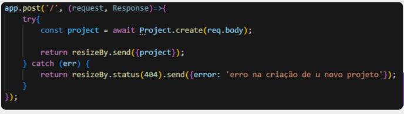
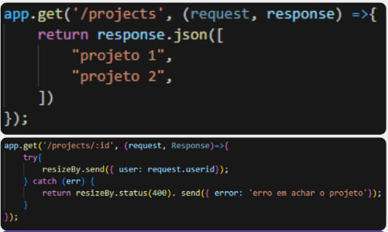
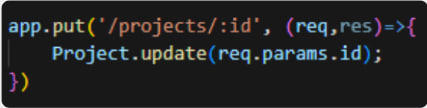
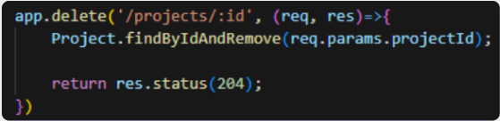

# Aulas Online (Indice)

- [Pensamento Computacional (JavaScript básico)](#pensamento-computacional)
- [HTML e CSS](#htmlcss)
- [JavaScript e Orientação a Objetos](#javascript-e-orientação-a-objetos)
- [React](#react)
- [Web services - Client](#web-services---client)
- [Pasta de códigos exemplo](/codigos-exemplo/)

## Pensamento Computacional

### Blikstein (2008) afirma que o pensamento computacional é manusear o computador de forma criativa e eficaz para solucionar problemas. Então, essa forma de pensar é uma competência que está baseada na resolução de problemas de forma criativa e está fundamentada em quatro pilares

  > decomposição;  
  > reconhecimento de padrões;  
  > abstração;  
  > pensamento algorítmico ou simplesmente algoritmo.

#### **Explicação dos pilares**

- Decomposição: Divisão do problema em porções menores para facilitar a sua resolução.
- Reconhecimento de padrões: É o conjunto de fatos que apontam um problema.
- Abstração: Consiste em pensar no problema de maneira genérica, ignorando detalhes que não são importantes para a sua resolução.
- Algoritmo: Sequência de passos para resolver o problema.

## Lógica Imperativa

### O que é um algoritmo?

- Sequência de **passos finitos** e **ordenados** para resolver um problema.
- Para construir um algoritmo é necessário:

  > 1. A **entrada dos dados** que serão utilizados durante o processo e que são as informações iniciais recebidas;
  > 2. o **processamento** desses dados, que é formado pelos passos necessários para atingir uma meta;
  > 3. a **saída do resultado** do processamento, que mostra se o resultado foi eficaz ou não.

#### _Obs._ É importante lembrar que o algoritmo não é o resultado final, mas sim todo o processamento para chegar ao resultado

## Estruturas Condicionais

- Representam um fluxo de escolhas escritas em linhas de código.
  Quando um usuário precisa tomar uma decisão, podemos utilizar as estruturas condicionais para decidir qual linha de comando deve ser executada a partir da escolha feita por ele, diferente da estrutura sequencial.

- São divididas em:

  > 1. simples (if)
  > 2. composta (if - else)
  > 3. encadeada (if - else if - else)
  > 4. multipla escolha (switch)

- Obs. Pagina para melhorar a utilização do git [("Use Git like a senior engineer")](https://levelup.gitconnected.com/use-git-like-a-senior-engineer-ef6d741c898e)

## Array

- Tipos de Arrays (importantes)

  > Array com tamanho fixo (Ex: let tamanhoFixo = Array(5);)  
  > Array usando from (Ex: let arrayPorFrom = Array.from('JavaScript');) - Separa cada letra do string

- Spread(...): permite unir strings ou arrays (Ex: let numeros = [1,2,3]; let maisNumeros = [...numeros,4,5,6];)
- Manipulação de arrays (Inserção)

  > push(): adiciona um ou mais elementos ao final do array  
  > unshift(): adiciona um ou mais elementos no início do array  
  > splice(): adiciona ou altera o elemento em uma posição especifica  
  > Ex1: array.splice(2,0,3) {Adiciona o valor 3 na posição 2 do array (aumenta o tamanho do array)}  
  > Ex2: array.splice(2,1,3) {Substitui o valor na posição 2 do array para 3 (mantem o tamanho do array)}

- Manipulação de arrays (Remoção)

  > pop(): remove e retorna o último elemento do array  
  > shift(): remove e retorna o primeiro elemento do array  
  > splice(): pode ser usado para remover um elemento em uma posição especifica  
  > Ex: array.splice(2,1) {Remove o elemento da posição 2 do array}

- Manipulação de arrays (iteração com loops)  
  Loop forEach - é uma função nativa dos arrays em JavaScript que permite executar uma função para cada elemento do array. Esse loop é uma forma mais simplificada de percorrer os elementos, especialmente quando você não precisa de controle direto sobre o índice.

- Matriz bidimensional: array que contem arrays (array == matriz unidimensional)

## [Algoritmo e Estrutura de Dados](https://github.com/GabPSant/Softex/tree/main/codigos-testes/javascript/estruturas_de_dados)

### 1. [Filas](https://github.com/GabPSant/Softex/tree/main/codigos-testes/javascript/estruturas_de_dados/fila.mjs)

- Função: é uma estrutura de dados linear que segue o princípio do "primeiro a entrar, primeiro a sair" (FIFO: First-In-First-Out).

- Características:

  > Enfileirar (enqueue) - adicionar um elemento no final da fila  
  > Desenfileirar (denqueue) - remover um elemento do início da fila  
  > Frente (front) - consultar o primeiro elemento da fila  
  > Fundo (rear) - consultar o último elemento da fila  
  > Tamanho (size) - a quantidade de elementos na fila

### 2. [Listas](https://github.com/GabPSant/Softex/tree/main/codigos-testes/javascript/estruturas_de_dados/lista.mjs)

- Função: permitem **adicionar**, **remover** e **acessar** elementos por meio de seus índices. Elas são muito versáteis e podem ser usadas para várias tarefas de armazenamento e organização de dados.

- Operações básicas:

  > Inserção (insertion) - adiciona um novo elemento em uma posição específica ou no final dela.  
  > Remoção (deletion) - remove um elemento específico da lista.  
  > Busca (search) - procura um elemento específico da lista e retorna a sua posição ou referência.  
  > Atualização (update) - modifica o valor de um elemento existente na lista.  
  > Tamanho (size) - conta o número de elementos na lista.  
  > Verificação se está vazia (isEmpty) - Confere se a lista nõa contem elementos.

### 3. [Pilhas](https://github.com/GabPSant/Softex/tree/main/codigos-testes/javascript/estruturas_de_dados/pilha.mjs)

- Função: são fundamentais em programação para realizar gerenciamento de chamadas de funções, desfazer ações ou rastrear estados temporários. Se assemelham a um empilhado de objetos, onde o último item adicionado é o primeiro a ser removido. Essa ordem de operação é conhecida como Last-In-First-Out (LIFO).

- Operações básicas:

  > Empilhar (push) - recebe um parâmetro, que é o elemento que você deseja adicionar à pilha.  
  > Desempilhar (pop) - não recebe parâmetro, pois ela vai desempilhar o elemento do topo da pilha.  
  > Topo (top) - função não recebe parâmetro, pois ela apenas retorna o elemento que está no topo da pilha, sem modificá-lo  
  > Tamanho (size) - não recebe parâmetro, pois ela apenas retorna o elemento que está no topo da pilha, sem modificá-lo.  
  > Verificar se está vázia (isEmpty) - não recebe parâmetro, pois ela apenas verifica se a pilha está vazia.

#### **Obs**. Com Node.js em versão 14 ou superior é possivel usar a extensão 'mjs' (module javascript) para exportar e importar arquivos javascript (importante lembrar que tanto o arquivo que importa quanto o que exporta deve ter essa extensão)

## [Estruturas de Dados Dinamicas](https://github.com/GabPSant/Softex/tree/main/codigos-testes/javascript/estruturas_de_dados_dinamicos)

### Arvores

- é uma das estruturas de dados mais versáteis, sendo amplamente utilizada na ciência da computação. Ela é composta por nós conectados pelas arestas, formando uma estrutura hierárquica semelhante a uma árvore. Na programação, cada árvore tem um nó raiz (root), que é o ponto de partida para percorrê-la. Além disso, cada nó pode ter zero ou mais nós filhos, mas apenas um nó pai
- Assim como o mapa de navegação, as árvores ligadas são uma estrutura de dados que organiza informações de forma hierárquica, interligada e eficiente

- Operações fundamentais:

  > 1. Nó (node): É um elemento individual em uma árvore. Cada nó contém um valor (dados) e uma referência para seus nós filhos.
  > 2. Raiz (root): É o nó inicial da árvore, ou seja, o ponto de partida para percorrer toda a estrutura.
  > 3. Nó filho (child): É o nó que está diretamente abaixo de outro na hierarquia.
  > 4. Nó pai (parent): É o nó que está diretamente acima de outro na hierarquia.
  > 5. Nó folha (leaf): É o nó que não possui nós filhos, ou seja, está na extremidade da árvore.
  > 6. Nível (level): É o número de arestas entre o nó e a raiz. O nível da raiz é 0 e a aresta é a ligação de um nó com outro.
  > 7. Altura (higth): É o número de níveis em uma árvore. Caso uma árvore tenha apenas um nó, ou seja, o nó raiz, sua altura é zero (altura = nivel até chegar na folha).

- Função: As árvores são utilizadas para resolver diversos problemas na ciência da computação e engenharia de software

  > 1. _Estruturas de dados avançadas_: as árvores são a base para muitas estruturas de dados importantes, como árvores de busca binária, árvores de segmentos, árvores AVL, árvores B, entre outras.
  > 2. _Pesquisas eficientes_: as árvores de busca binária são, especialmente, úteis para pesquisas em grandes conjuntos de dados ordenados.
  > 3. _Jogos e inteligência artificial_: as árvores de jogos são usadas para analisar as várias opções e determinar a melhor jogada possível.

- Beneficíos: Árvores na programação são estruturas hierárquicas que nos possibilitam organizar dados de forma inteligente e eficiente, trazendo elegância e agilidade para nossos algoritmos.

### Listas Encadeadas

- As listas ligadas ou encadeadas são estruturas de dados fundamentais. Elas consistem em uma sequência de elementos chamados de "nós", onde cada um aponta para o próximo.
- Diferentemente dos arrays, as listas ligadas não precisam alocar memória contínua para armazenar os elementos, sendo dinâmicas e flexíveis.
- Conceitos básicos:

  > 1. Nó (node): É a unidade básica de uma lista ligada. Contém o dado a ser armazenado e um ponteiro (referência) para o próximo nó da lista.
  > 2. Cabeça (head): É o primeiro nó da lista. Serve como ponto de partida para percorrer toda a estrutura.
  > 3. Cauda (tail): É o último nó da lista. Seu ponteiro aponta para null, indicando o fim da lista.
  > 4. Ponteiro (pointer): É a referência de um nó para o próximo da lista, mantendo a conexão entre eles.

- Função: As listas ligadas podem ser aplicadas em diversos cenários. Por exemplo, quando não sabemos a quantidade exata de elementos que precisamos armazenar ou quando as operações de inserção e remoção de elementos são frequentes.

  > 1. _Gerenciamento de memórias_: As listas ligadas são comumente usadas em sistemas operacionais para gerenciar a memória livre e a ocupada.
  > 2. _Implementação de filas e pilhas_: Essas estruturas podem ser facilmente implementadas por meio das listas ligadas. A inserção e remoção ocorrem sempre no início (pilhas) ou no final (filas) da lista.
  > 3. _Listas encadeadas duplamente encadeadas_: Nesta variação, cada nó possui um ponteiro para o próximo e outro para o nó anterior, permitindo percorrer a lista em ambas as direções.

- Operações básicas:

> Inserção no início (push) - Adiciona um novo elemento no início da lista, tornando-o o novo nó cabeça (head).  
> Inserção no fim (shift) - Adiciona um novo elemento no final da lista, tornando-o o novo nó cauda (tail).  
> Inserção no meio (splice) - Adiciona um novo elemento em uma posição específica da lista.  
> Remoção no início (pop) - Remove o primeiro elemento da lista. O segundo será a nova cabeça.  
> Remoção no fim - Remove o último elemento da lista. O penúltimo será o novo nó cauda.
> Remoção no meio - Remove um elemento de uma posição específica da lista.
> Busca (search) - Essa operação procura por um elemento específico na lista e, caso seja encontrado, retorna o nó correspondente (a busca geralmente começa pela cabeça).
> Tamanho da lista - Essa operação conta o número de elementos presentes na lista (se avalia começando da cabreça até a cauda).

- Classe Nó: Define a menor estrutura de uma lista ligada, que é o nó. Ela possui um construtor e dois atributos (Nome e próximo). Nome pode ser passado no construtor do nó durante a instância e deve receber uma string contendo o nome. Já o atributo próximo deve receber um outro objeto do tipo nó.
- Classe ListaLigada: Essa classe define a estrutura ligada com vários nós e as operações necessárias para a manipulação da lista ligada. Ela possui um construtor que recebe o nó cabeça da lista, além de ter os métodos referentes às operações que vimos anteriormente.
- Métodos da classe ListaLigada:

  > 1. addFirst: Esse método instancia um novo nó com um nome que será adicionado. O novo nó recebe a cabeça da lista ligada como o próximo. Assim, a nova cabeça passa a ser o nó que foi adicionado.
  > 2. addLast: Esse método instancia um novo nó com um nome que será adicionado. Se esse nó for o primeiro da lista, ele se tornará a nova cabeça. Caso contrário, a operação fica sendo executada até que o próximo de algum nó esteja vazio. Quando isso acontecer, o novo nó será encadeado na lista ligada.
  > 3. removeFirst: Esse método sempre remove o primeiro elemento de uma lista ligada, o qual sempre será o primeiro e, por isso, sempre será a cabeça da lista ligada. Dessa forma, a nova cabeça será o próximo nó da cabeça que será removida.
  > 4. removeLast: Esse método sempre remove o último elemento de uma lista ligada. Para isso, deve-se sempre começar da cabeça da lista, verificando se o próximo é vazio. Se o próximo de um nó for vazio, esse é o nó que será removido.
  > 5. search: Verifica se o elemento do nó é igual ao que está sendo pesquisado. Se sim, retorna o nó encontrado. Caso contrário, vai para o próximo do nó e continua pesquisando. Se chegar ao fim da lista e ainda não ter encontrado o nó, o valor retornado é nulo.

## [Algoritmos de Busca](https://github.com/GabPSant/Softex/tree/main/codigos-testes/javascript/algoritmos_de_busca)

- Essas ferramentas nos permitem localizar elementos em listas, vetores ou estruturas de dados de forma rápida e inteligente.
- São técnicas fundamentais na ciência da computação e têm aplicação em diversas áreas, como pesquisa em bancos de dados e resolução de problemas em inteligência artificial.
- Eles permitem que você encontre um elemento específico em uma estrutura de dados, como lista, array ou árvore, de forma eficiente.
- Existem diferentes tipos de algoritmos de busca, sendo os principais a **busca linear** e a **busca binária**. Ambos possuem as suas particularidades e são os mais adequados para determinados cenários.

### Busca linear ou sequencial

- É o método mais simples de busca, no qual os elementos são percorridos sequencialmente até que o valor procurado seja encontrado ou a busca termine. Ele é útil quando a coleção de dados não está ordenada ou quando não se sabe a posição exata do elemento procurado. No pior caso, a busca linear tem uma complexidade de tempo _O(n)_, sendo "n" o número de elementos na coleção.
- Essa abordagem é útil quando os elementos estão desordenados ou quando a lista é **pequena o suficiente** para ser percorrida facilmente.
- Conceitos:

  > 1. _Coleção de dados_: Essa estrutura contém os elementos que serão pesquisados. Pode ser um array, uma lista ou qualquer outra que possibilita o acesso sequencial aos elementos.
  > 2. _Elemento de busca_: É o valor que desejamos encontrar na coleção de dados.
  > 3. _Percorrer a coleção_: Significa analisar cada elemento da coleção até que o buscado seja encontrado.
  > 4. _Complexidade de tempo_: No pior caso, a busca linear precisa percorrer todos os elementos da coleção. Portanto, a sua complexidade de tempo é O(n), sendo "n" o número de elementos na coleção.

- Obs. Não muito eficiênte para grandes conjuntos de dados.

### Busca binária

- É o método mais eficiente para aplicar em coleções ordenadas. A sua estratégia consiste em dividir, repetidamente, a coleção ao meio, descartando metade dos elementos a cada passo até que o valor seja encontrado.
- A busca binária tem uma complexidade de tempo O(log n), que é consideravelmente mais rápida do que a busca linear, especialmente em coleções grandes.
- A busca binária é uma estratégia inteligente, pois **reduz significativamente** o espaço de busca a cada tentativa.
- Conceitos:

  > 1. _Coleção ordenada de dados_: A busca binária exige que a coleção de dados esteja ordenada, seja em ordem crescente ou decrescente. Caso contrário, não será possível aplicar a estratégia de descarte da metade da   coleção.
  > 2. _Divisão recursiva_: O algoritmo divide, repetidamente, a coleção ao meio, comparando o valor buscado com o do meio da coleção. Dependendo da comparação, o algoritmo prossegue com a busca na metade esquerda ou direita da coleção.
  > 3. _Complexidade de tempo_: A complexidade de tempo da busca binária é O(log n), sendo "n" o número de elementos na coleção. Isso significa que a busca binária é muito mais rápida em coleções grandes do que a busca linear O(n), tornando-a uma opção muito eficiente.

- Obs. Só funciona em coleções ordenadas, muito eficiente para grandes conjuntos de dados.

## HTML/CSS

### HTML (HyperText Markup Language)

- Linguagem de Marcação de [Hipertexto](https://tableless.com.br/sobre-hipertextos/), em português, é um conjunto de sinais e códigos aplicados a um texto, que contribui para definir exibições na tela e estruturas de dados em um sistema.
- Serve para o navegador interpretar os elementos de uma página. É ela que dá a estrutura da página, ou seja, dá significado e organiza as informações de uma página na web. Sem a HTML, o navegador não conseguiria exibir textos, elementos ou carregar imagens.
- Surgiu a partir da necessidade de criar, editar e compartilhar hipertextos pela internet.

#### Tags/Hipertexto

- DOM (Document Object Model ou Módelo de Objeto de Documentos): é um modelo de documento carregado pelo navegador. Este documento é representado através de uma árvore de nós, onde cada um destes nós representa uma parte do documento (por ex. um elemento, texto ou comentário).
- Função: as tags são estruturas de linguagem de marcação. Elas contêm instruções que servem para informar a estrutura do site ao navegador e construir elementos da HTML. Quando são utilizadas corretamente, elas contribuem bastante para o [SEO](https://rockcontent.com/br/blog/o-que-e-seo/) de um site.

##### Atributos

1. **class**: Atribui uma classe CSS para uma tag. Isso faz com que a CSS e a linguagem Javascript selecionem e acessem elementos específicos do código HTML;
2. **id**: Atribui um id CSS para uma tag. Seu objetivo é identificar o elemento quando utilizar scripts ou estilizar com CSS;
3. **href**: Referenciar um URL externo, seja um link ou um arquivo;
4. **src**: Atribui um URL para um conteúdo. Por exemplo, uma imagem ou um arquivo;
5. **type**: Atribui o tipo do elemento;
6. **value**: Atribui o valor padrão de um elemento.

##### Classificação/Tipos de tags

- É possível categorizar as tags em dois tipos: o block-level (nível de bloco) e o inline (em linha). O primeiro ocupa todo o espaço do seu elemento pai e o segundo ocupa apenas o espaço do seu conteúdo.
- Tags básicas (servem para definir a estrutura fundamental da página):
  - DOCTYPE - Responsável pela versão HTML usada na página e a tag HTML.  
  - HTML - estrutura a página web  
- Tags metadados (responsáveis para guardar informações da página como estilos, scripts e dados. Ajuda na renderização da página pelo navegador)
  - head ->  contem os dados metas
  
    > link - representa o link que sera usado no arquivo html  
    > meta - representa informações que não podem ser lidas em outras formatos  
    > style - representa informações de estilo usadas no arquivo html  
    > title - contem o título da página

- Tags de separação de contéudo (responsáveis pela organização lógica da página):
  - address -> Contêm as informações de contato do autor
  - h1 a h6 -> Definem o tamanho do título
  - article -> representa uma região independente que pode conter certo conteúdo
  - aside -> representa a região lateral da página (tem uma relação paralela com o conteúdo príncipal/main)
  - footer -> representa o ródape da página, geralmente contêm as informações do autor, direitos autorais ou links relacionados
  - header -> representa o cabeçalho, contêm a introdução da página e contêm apoio para navegar pela página
- Tags de texto (responsáveis por todos os tipos de texto que serão impressos na página):
  - p -> elemento paragrafo, é usado para criar linhas de texto
  - hr -> é usado para separar os paragrafos do html
  - div -> é um container genérico, pode ser usado para agrupar items para estilizar a página
  - ol -> ordeneted list (lista ordenada), serve para criar listas ordenadas
  - ul -> unordeneted list (lista não ordenada), serve para criar listas não ordenadas
  - li -> list item (item de lista), é necessário para definir um item da lista
- Tags para semântica textual inline (utilizada para definir a estrutura, linha ou significado de qualquer outro tipo de texto):
  - a -> elemento âncora, é usado para criar uma hiperligação entre páginas web, arquivos, endereçõs de e-mail etc.
  - b -> Usado para separar certos elementos semânticos do texto. (não são de grande importância semântica, só tem uma semântica diferente do texto no qual estão contidos).
  - br -> Serve para quebrar a linha dos textos.
  - q -> é usado para citações ([explicação](https://developer.mozilla.org/pt-BR/docs/Web/HTML/Element/q))
  - strong -> coloca o texto em negrito (usado para textos com muita importância).
- Tags de multimídia (Manipulam imagens e vídeos):
  - img -> representa a inserção de imagem no documento
  - iframe -> é uma tag que permite a exibição de um elemento dentro de outro elemento ([explicação](https://www.hostinger.com.br/tutoriais/o-que-e-iframe))
  - picture -> contem as tags 'img' e 'source' ([explicação](https://developer.mozilla.org/en-US/docs/Web/HTML/Element/picture))
  - source -> é usado para contem as fontes/hiperlinks de imagens, audios e vídeos
- Tags de tabelas (são usadas, hoje em dia, na criação de templates de e-mail):
  - table -> cria a tabela no html (contém todas as outras tags)
  - tbody -> define o corpo da tabela
  - td -> define as celulas da tabela
  - tr -> define uma linha na tabela
- Tags de formulário (usadas para criar formatação e input):
  - form -> usada para criar formulários (contém todas as outras tags)
  - input -> tag usada para definir imput do usuário
  - label -> tag usada para definir uma legenda para um item em uma interface de usuário
  - button -> representa um botão clicável
  - fieldset -> agrupa os elementos do formulário de forma organizada
  - legend -> representa um rótulo para o conteúdo do 'fieldset'
  - option -> representa uma opção dentro do campo 'select', 'datalist' ou 'optground'
  - textarea -> conseguir receber input do usuário em formato livre, como um comentário ou formulário de retorno
- Tags de Script (permitem a ligação direta da linguagem JavaScript para objetos dinâmicos):
  - canvas -> pode ser usado para criar gráficos usando scripts ([explicação](https://developer.mozilla.org/pt-BR/docs/Web/HTML/Element/canvas))
  - noscript -> quando é necessário usar um script não suportado pelo navegador da página
  - script -> serve para executar código dentro do html.
- Forms
  - Servem para criar formulários (contem as tags input)

### CSS

- Pontos principais (os links são para códigos exemplos no repositório):
  - [Media query](../codigos-exemplo/css/media_query.css)
  - [Pseudo-classes](../codigos-exemplo/css/pseudo_classes.css)
  - [Pseudo-elementos](../codigos-exemplo/css/pseudo_elementos.css)
  - [Transições](../codigos-exemplo/css/transicoes.css)
  - [Animação](../codigos-exemplo/css/animacao.css)
  - [Transformações](../codigos-exemplo/css/transformacoes.css)
  - [Easing fuctions](../codigos-exemplo/css/easing_functions.css)

#### Principios básicos de design de animação

- Timing
  - O timing refere-se à duração de uma animação e à velocidade com que ela se move.
  - O timing certo pode fazer uma animação aparentar natural, como o movimento de um galho ao vento ou a forma como uma bolha sobe na água.
  - O timing deve ser considerado com base no contexto. Por exemplo, uma animação de feedback para um botão pressionado deve ser rápida e imediata, enquanto uma animação de introdução pode ser mais lenta e deliberada.
- Sequência
  - A sequência refere-se à ordem e ao arranjo de múltiplas animações ou ações.
  - Uma boa sequência ajuda a guiar a atenção do usuário e a entender uma série de eventos. Ela também pode dar um sentido de ritmo e cadência.
  - Em interfaces, a sequência pode ser usada para guiar o olho do usuário de um ponto de foco para outro ou para estabelecer uma hierarquia visual. Por exemplo, ao carregar uma página, elementos principais podem aparecer primeiro, seguidos de elementos secundário.
- Feedback
  - É uma animação ou ação que informa ao usuário que sua ação foi reconhecida.
  - O feedback visual ajuda a confirmar as ações dos usuários, tornando a interface mais intuitiva e confiável.
  - Em UI/UX, o feedback pode ser tão simples quanto um botão mudando de cor ao ser clicado ou um ícone agitando-se quando uma ação não pode ser completada.
- Facilitação (ou easing, em inglês)
  - Refere-se à aceleração e desaceleração de uma animação ao longo do tempo.
  - Ela dá uma sensação de realismo e fluidez. Na vida real, poucos movimentos começam e terminam abruptamente; geralmente, eles aceleram e desaceleram.
  - Em CSS, a facilitação é frequentemente controlada pela propriedade transition-timing-function ou por funções cubic-bezier personalizadas. A escolha do tipo de facilitação pode afetar drasticamente como uma animação é percebida, seja dando uma sensação de leveza, peso ou elasticidade.

## JavaScript e Orientação a Objetos

### JSON (JavaScript Object Notation/ Notação de Objetos JavaScript)

- Permite armazenar objetos JS em um formato mais:
  - Mais rápido na execução
  - Com espaço menor e mais légivel
- São usados em:
  - API (Application Programming Interface ou  interfaces de programação de aplicativos) como armazenadores de dados
  - Comunicação entre sistemas Front-End e Back-End
- Regras do JSON
  - **Não** pode ter funções
  - **Não** pode ter comentários
  - E as propriedades e textos sempre precisam ter **aspas duplas**
- Em JavaScript, podemos usar a biblioteca 'JSON' para **converter um objeto em um json**.
  - Ex: const jsonData = JSON.stringify(objs);
  - A função 'stringify()' converte o objeto criado em JS para o formato JSON
  - O JavaScript enxerga o JSON como string
- Em Javascript, podemos usar a biblioteca 'JSON' para **converter um JSON em um objeto**.
  - Ex: const obj = JSON.parse(valorJSON);

### HTTP

- Protocolo HTTP
  - Você já deve ter observado que cada site possui um URL. Conforme acessamos suas abas e realizamos ações, o final do URL vai mudando, mas você sabe como isso funciona?
- O que é o protocolo HTTP?
  - HyperText Transfer Protocol (HTTP) é um protocolo, ou seja, um conjunto de regras que o servidor precisa seguir para transmitir todos os tipos de dados pela internet.
  - O HTTP possibilita que as pessoas insiram o URL do site na web e, dessa forma, possam ver os conteúdos e dados que existem nele.
- Métodos HTTP
  - Aprendemos que existem métodos para **criar**, **ler**, **modificar** ou **atualizar** e **deletar** informações, sendo cada um configurado em um URL. Relembre os mais utilizados:

    | Operador | Objetivo                                                                                                   |
    | -------- | ----------------------------------------------------------------------------------------------------------------------- |
    | get      | Utilizado para ler dados. Ele faz a leitura e retorna a informação desejada para o usuário.                |
    | post     | Utilizado para criar ou adicionar um novo item ao URL solicitado. Por exemplo, criar uma nova conta ou postar um comentário novo em um blog. |
    | put      | Utilizado para modificar ou substituir os dados atuais pelos dados solicitados. Por exemplo, alterar a senha em um site. |
    | delete   | Utilizado para excluir todos os dados do local de destino solicitado pelo usuário. É uma operação arriscada, pois não pode ser recuperada depois de excluída. |

- Se já existe um código Node.js com métodos HTTP criados, seria necessário fazer outro código no front-end e na linguagem JavaScript para testá-lo? 
  - Não necessariamente. Atualmente, quando um back-end é criado, é possível testá-lo em programas, como o [Insomnia](https://insomnia.rest/download) e o [Postman](https://www.postman.com).
- Aplicação de Rotas
  - Nesses programas, só é preciso colocar o URL e um método HTTP para o programa mostrar o retorno. Assim, é possível testar suas rotas e saber quais métodos estão falhando.
- Aprendendo a criar rotas
  - Agora, veremos como utilizar esses métodos HTTP em código na linguagem JavaScript. Para isso, vamos precisar [instalar alguns pacotes](https://www.youtube.com/watch?v=mdig0FJwJcQ).
    
    > O vídeo explica como:  

    > Instalar node.js  ([link]())
    > Iniciar o npm (Node Package Manager) [comando: npm init]  
    > Instalar express.js [comando: npm install express --save]  
    > Como usar o express.js  
    > Explica sobre [Middlewares](https://expressjs.com/pt-br/guide/using-middleware.html)  
    > Instalar o nodemon.js (é importante para automatizar a atualização do servidor) [comando: npm install --save-dev nodemon]  
    > Como usar o nodemon.js [comando: npx nodemon (nome do arquivo).js]
    > E usar o Postman para testar o servidor criado

  - Para conectar o seu projeto no programa, é necessário deixar o back-end ativo com o [Express](https://expressjs.com/pt-br/). Para isso, você deve utilizar a biblioteca [nodemon](https://www.npmjs.com/package/nodemon), que ativará o back-end automaticamente.

### Frameworks

- Eles são muito úteis no mercado de trabalho, pois você pode usá-los de acordo com suas necessidades, seja no front-end ou back-end.
- O que é um Framework?
  - Ele é uma ferramenta cujo objetivo é focar no desenvolvimento do projeto e não em detalhes de configurações.
  - O framework evita tarefas repetitivas, pois ele automatiza parte do trabalho.

    > Por exemplo, imagine que temos que criar um formulário e precisamos da [validação de e-mail](https://www.devmedia.com.br/validando-e-mail-em-inputs-html-com-javascript/26427). O framework já tem a validação pronta para facilitar o processo, mas isso não impede que o programador, caso queira, faça sua própria validação.

- Frameworks para JavaScript
  - Existem vários frameworks JavaScript disponíveis. Agora, vamos conhecer os mais utilizados:
    
    > [React.js](https://pt-br.legacy.reactjs.org) - é uma ferramenta para o front-end conhecida por ser uma biblioteca para criar interfaces eficientes. Tem como característica a facilidade na hora de ter um código limpo e reutilizável;

    > [AngularJS](https://angularjs.org) - desenvolvido pelo Google, é um  framework open source muito utilizado para criar as [Single Page Applications (SPA)](https://www.devmedia.com.br/ja-ouviu-falar-em-single-page-applications/39009). Essa é uma tecnologia comumente encontrada nas empresas.

    > Também existem outros frameworks para front-end, como [Vue.js](https://vuejs.org), [Ember.js](https://emberjs.com) e o [Preact.js](https://preactjs.com). Para back-end, os mais utilizados são o Node.js e o Express.js. 
  
  - Um exemplo de utilização de framework é a conexão com um banco de dados através do Node.js e seus módulos.

- O que é um banco de dados?
  - De forma resumida, um **banco de dados** é um conjunto de dados ordenados onde é possível armazenar e manipular informações, além de gerenciar quem tem acesso a elas.
  - Além disso, podemos administrá-los através de um sistema de gerenciamento de banco de dados chamado [SGBD](https://www.fiveacts.com.br/sgbd), que possibilita o cadastro, a consulta, a edição e a exclusão de informações em um banco de dados.

### Implementando Banco de Dados

- O que é Sequelize?
  - Sequelize é utilizado, especialmente, em aplicativos e sistemas web para interagir com bancos de dados relacionais de forma mais fácil e eficiente. Imagine um banco de dados como uma gigantesca prateleira com várias caixas organizadas, que contêm informações importantes, e você precisa encontrá-las ou ajustá-las. A tarefa do Sequelize é atuar como um assistente pessoal que simplifica o processo de localizar, adicionar, atualizar ou remover itens nessas caixas.
  - Com o Sequelize, é possível criar consultas em formato de código, economizando tempo e garantindo uma melhor estrutura e segurança no acesso aos dados. Por isso, ele é uma ferramenta valiosa para facilitar o trabalho com informações em aplicativos e sistemas complexos, possibilitando que os desenvolvedores se concentrem mais na lógica de negócios do que nos detalhes da interação com o banco de dados.
- Como Sequelize atua?
  - Ele é uma biblioteca de Object-Relational Mapping (Mapeamento objeto-relacional, em tradução livre), ou ORM, para Node.js. As suas interações acontecem com bancos de dados relacionais, como MySQL, PostgreSQL, SQLite e outros. 
  - O Sequelize atua como uma camada de abstração entre o código JavaScript e o banco de dados. Assim, os desenvolvedores podem interagir com o banco de dados, usando objetos e métodos familiares em vez de escrever consultas SQL manualmente.
- Principais características do Sequelize:

  | Característica        | Objetivo                                                                                              |
  | --------------------- | ------------------------------------------------------------------------------------------------------|
  | Modelo                | possibilita definir modelos que representam tabelas do banco de dados como classes JavaScript. Cada modelo corresponde a uma entidade no banco de dados, com suas colunas e associações. |
  | Migrações             | suporta migrações, que são arquivos que descrevem alterações no esquema do banco de dados. Com elas, é possível criar, atualizar e excluir tabelas e colunas do banco de dados de forma controlada. |
  | Consultas e operações | possibilita a realização de operações CRUD (Create, Read, Update, Delete) no banco de dados usando métodos simples, como **create()**, **findAll()**, **update()** e **destroy()**. |
  | Relacionamentos       | facilita o estabelecimento de relacionamentos entre diferentes modelos, como **um-para-um**, **um-para-muitos** e **muitos-para-muitos**. |
  | Validações            | suporta a definição de validações para garantir a integridade dos dados antes de serem salvos no banco de dados. |
  | Consultas personalizadas | além das operações CRUD, o Sequelize oferece a execução de consultas personalizadas usando a sintaxe das suas consultas. |
  | Compatibilidade com várias bases de dados | é compatível com vários bancos de dados SQL, possibilitando que os desenvolvedores usem o mesmo código em diferentes bancos de dados. |

- Em Resumo:
  
  > O Sequelize é uma ferramenta poderosa para facilitar o desenvolvimento de aplicações Node.js, que interagem com bancos de dados relacionais. Ele oferece uma abordagem orientada a objetos para a manipulação de dados, simplificando o código e melhorando a produtividade do desenvolvedor ao trabalhar com bancos de dados SQL.

- Como usar o Sequelize em um projeto, passo-a-passo ([Site de apoio](https://www.treinaweb.com.br/blog/usando-sequelize-orm-com-node-e-express))
  - *Passo 1*: Configuração do Projeto
    
    > Você precisa ter o Node.Js instalado em seu computador. Depois, crie um novo diretório para o projeto e acesse-o no terminal. 
     
    > Inicie um novo projeto Node.js executando

      ```bash
      npm init
      ```
    
    > Siga as instruções para criar o arquivo package.json.

  - *Passo 2*: Instalação das dependências

    > Instale o Sequelize e os drivers do banco de dados que você vai utilizar, como MySQL ou PostgreSQL, por meio do comando no terminal(para MySQL8):  

      ```bash
      npm install sequelize sequelize-cli mysql8
      ```

  - *Passo 3*: Configuração da conexão com o banco de dados

    > Crie um arquivo chamado config.js na raiz do projeto para configurar a conexão com o banco de dados. Por exemplo, para usar o MySQL, basta adicionar o código ao arquivo. ([Código exemplo](../codigos-exemplo/banco-de-dados/config.js))

  - *Passo 4*: Criação do modelo do produto

    > Crie um diretório chamado **models** na raiz do projeto.

    > Dentro do diretório **models**, crie um arquivo chamado **produto.js** para definir o modelo do produto ([código exemplo](../codigos-exemplo/banco-de-dados/models/produto.js)).

  - *Passo 5*: Criação das migrações

    > No terminal, execute o seguinte comando para criar uma migração para a tabela  
    > Produto:

      ```bash
      npx sequelize migration:generate --name create_produto
      ```

    > Isso criará um novo arquivo dentro do diretório **migrations**.

  - *Passo 6*: Criação das tabelas Produto

    > Abra o arquivo e adicione o código para criar a tabela **Produto** com as colunas correspondentes.

  - *Passo 7*: Execução das migrações - Continuar daqui, resolver essa etapa

    > No terminal, execute o comando:  

      ```bash
      npx sequelize migration:generate
      ```

    > Para aplicar as migrações e criar a tabela no banco de dados.

### Programação Orientada a Objetos

#### Introdução a Programação Orientada a Objetos

  - História da POO
    - A Programação Orientada a Objetos (POO) é um [paradigma da programação](https://guia.dev/pt/pillars/languages-and-tools/programming-paradigms.html), que tem como base o conceito de objetos, que podem conter atributos e métodos.

      > Por exemplo, o objeto carro possui atributos como modelo, marca, ano de fabricação e cor. Além disso, possui métodos, que são as funcionalidades do carro, como é possível ver na imagem a seguir.
    
    - A POO foi inventada na década de 1970, por Alan Kay (1940- ), matemático e biólogo. Porém, ela só se tornou popular na década de 1990, por causa da influência da linguagem de programação C++. 
    - Atualmente, muitas linguagens de programação têm suporte para a Programação Orientada a Objetos, como JavaScript, Python, PHP e Ruby.
  - Intuito da POO
    - A POO foi criada com o objetivo de facilitar a programação e aproximar a lógica dos códigos ao mundo em que vivemos, tornando mais prático e usual para qualquer tipo de software. Assim, ela considera que tudo que existe é um objeto, podendo ser ele material ou abstrato.

      > Por exemplo: um mouse, uma casa e uma moto são materiais; já uma música e uma transação bancária são abstratos.

    - Esse paradigma vem sendo cada vez mais inserido no desenvolvimento de softwares, pois há diversas características positivas na sua utilização.
  
  - Lógica da POO
    - Confiável

      > A divisão das partes do software o torna mais seguro, gerando independência no código. Logo, as partes não são afetadas quando mudadas.

      > Exemplo: um objeto “Relógio” possui um objeto “Pilha” dentro dele e eles trabalham em conjunto, mas o relógio não depende de uma pilha específica, pois ela pode ser modificada inúmeras vezes e o relógio continuará funcionando normalmente.

    - Oportuno
      
      > Devido à divisão das partes do software e à independência entre elas, os códigos podem ser criados em paralelo, deixando o processo mais ágil.

      > Exemplo: o “Relógio” e a “Pilha” não precisam ser criados em uma ordem, eles podem ser desenvolvidos de forma paralela, pois a criação de um não depende da do outro.

    - Ajustável 

      > Ao realizar alguma manutenção em uma parte do código, todas as outras serão beneficiadas automaticamente.

      > Exemplo: ao realizar o ajuste da “Pilha” do “Relógio” por uma de qualidade superior, tanto a “Pilha” quanto o “Relógio” serão beneficiados.

    - Extensível

      > O software não é estático, ele deve se manter em desenvolvimento para seguir com utilidade. Dessa forma, não é preciso criar algo com funcionalidades similares, pois o software pode ser facilmente estendido e aprimorado.

      > Exemplo: a empresa fabricante de relógios está interessada em produzir um novo relógio com mais funcionalidades, mas por ser um produto extensível, a ação mais recomendada e econômica é apenas seguir com o relógio existente e adicionar novas funcionalidades a ele.

    - Reutilizável

      > O objeto de um sistema pode ser utilizado em outros sistemas, desde que tenham compatibilidade.

      > Exemplo: O ponteiro de um relógio  pode ser reutilizado em outros relógios, desde que haja o mesmo espaço na sua estrutura.

    - Natural

      > Um dos pontos mais importantes na POO é o foco na realidade, visando sempre a simplicidade da compreensão. Assim, a programação ganha naturalidade e facilita conversas e resoluções de problemas.
  
  - POO X PE

    - É possível entender a lógica da Programação Orientada a Objetos após a compreensão das suas seis vantagens.
    - Diferente da Programação Estruturada (PE), que é recomendada para a resolução de um problema específico, a POO é muito utilizada na criação de sistemas mais complexos, pois entrega melhores resultados nesses tipos de programas. Ambas têm lados positivos e negativos, por isso, suas utilizações irão depender de cada caso.

#### Visibilidade de atributos e métodos

  - No desenvolvimento de um sistema Orientado a Objetos, a visibilidade dos atributos e métodos é baseada no conceito do [Diagrama de Classes UML](https://www.lucidchart.com/pages/pt/o-que-e-diagrama-de-classe-uml) (Linguagem de Modelagem Unificada).
  - Esse diagrama é um dos mais usados da UML e tem o objetivo de facilitar o mapeamento da estrutura de um determinado sistema. Assim, ele possibilita uma melhor compreensão dos requisitos necessários para o desenvolvimento da programação.
  - A visibilidade define quais classes específicas poderão usar ou ter acesso a determinados elementos de outras classes, como os atributos, que são as variáveis, e os métodos.
  - Modificadores de Visibilidade
    - Os [modificadores de visibilidade](https://www.alura.com.br/apostila-python-orientacao-a-objetos/encapsulamento) são aplicados em atributos e métodos e representados por palavras-chave ou símbolos. 
    - Na estruturação de um código, independente de qual modificador será usado, é necessário inserir a visibilidade para cada método e atributo.
    - Tipos de modificadores:

      | Modificador | Definição |
      | ----------- | --------- |
      | public (público) | É o modificador que tem menos restrição. **Ele possibilita que os atributos e métodos sejam visualizados e manipulados a partir de qualquer classe**. |
      | private (privado) | É o modificador de visibilidade que tem a função de restringir totalmente o acesso. **Ele impossibilita a visualização e a manipulação dos atributos e métodos por qualquer outra classe que não seja a sua de origem**. |
      | protected (protegido) | Esse modificador **possibilita que os atributos e métodos sejam visualizados e manipulados a partir da sua classe de origem e todas as suas subclasses**. Ele será melhor compreendido quando definirmos o conceito de [herança](https://br.ccm.net/contents/414-poo-heranca).

    - Embora JavaScript não tenha modificadores de visibilidade como outras linguagens (como "private", "public", etc.), existem maneiras de indicar que um atributo ou método deve ser tratado como "privado". Duas formas comuns são:

      > **Usar um sublinhado (underline)**: Se um atributo ou método começar com um sublinhado (underline), geralmente significa que é "privado". Não é uma regra rigorosa imposta pelo JavaScript, mas é uma convenção entre os programadores.

      > **Adicionar um prefixo "#private"**: Uma outra forma é adicionar o prefixo "#private" antes do nome do atributo ou método. Isso também é uma convenção.

#### Reutilização de classes ([Herança](https://www.devmedia.com.br/poo-reusabilidade-e-eficiencia-em-seu-codigo/31463))
  
  - O que é herança?
    - Herança, um dos [pilares da POO](https://www.devmedia.com.br/os-4-pilares-da-programacao-orientada-a-objetos/9264), tem a ideia geral de reutilização de classes para tornar um programa mais eficiente e prático, tomando menos tempo para a sua criação geral.
    - A herança permite que novas classes sejam geradas a partir de classes já existentes, ou seja, que novas classes herdem características de outras existentes. Semelhante a uma relação de família, na qual o filho herda características da mãe.
  - Fundamentos para criar uma herança
    - A classe principal é chamada de **superclasse (classe mãe)** e as que herdam são chamadas de **subclasse (classe filha)**. Ao utilizar heranças em um código, é necessário analisar quais atributos e métodos da classe poderão ser herdados com base nos modificadores de visibilidade.
    - É fundamental compreender que esses atributos e métodos herdados não serão identificados no código-fonte como classes filhas. Entretanto, estarão presentes e poderão ser acessados normalmente a partir de métodos assessores, modificadores ou construtores.
  - [Exemplo prático](../codigos-exemplo/javascript/heranca.js)

#### Pacotes de Classes

  - O que são pacotes?
    - No desenvolvimento de um sistema Orientado a Objetos, existem inúmeras classes que geram funcionalidade no código e os pacotes de classes para organizá-las.
    - Esses pacotes podem possuir interfaces ou classes concretas e abstratas.
  - Função dos pacotes
    - Existem pacotes que são de origem [Application Programming Interface (API)](https://canaltech.com.br/software/o-que-e-api/), que é a linguagem de POO utilizada para a criação de sistemas.
    - Eles têm a função de promover a reutilização de códigos na realização de atividades repetitivas. Além disso, com eles, é possível utilizar classes criadas por outros usuários sem causar conflito no código.
  - Pacotes em JavaScript
    - Em JavaScript, o conceito de pacotes é frequentemente associado à gestão de dependências e à organização de código em módulos reutilizáveis.
    - Embora JavaScript em si não tenha um sistema de pacotes integrado, a comunidade de desenvolvedores criou ferramentas externas para gerenciar pacotes e módulos de maneira eficaz.
  - Modularização em JavaScript
    - Os módulos são utilizados para facilitar o desenvolvimento de grandes sistemas, cujo foco é dividir grandes programas em pequenos módulos. Assim como as fábricas são dividas em setores e o corpo humano dividido em sistemas.
    - Assim, a técnica de modularização torna o programa mais compreensível, pois partes da programação podem ser organizadas em diferentes módulos. Essa divisão mantém a programação sistematizada e setorizada em funções, facilitando a manutenção do código e o encontro de possíveis erros.
    - Os módulos possuem **funções**, **variáveis**, **classes** e **objetos definidos**. Ou seja, são artefatos que contêm definições e instruções de código em JavaScript.
    - Assim, cada módulo é usado durante a programação como forma de **aumentar a capacidade da linguagem e acrescentar novas funções**.
    - Portanto, a técnica de **módulos** consiste em separar o código principal das funções que o programa pode ou não utilizar. O programa principal pode importar várias funções, desde que elas já tenham sido **programadas em arquivos diferentes**.
  - Modulos e pacotes em JavaScript
    - O uso de módulos é de extrema importância quando a programação começa a ficar grande.
    - Porém, quando temos vários módulos ou grandes programações em um único módulo, temos que passar a usar os pacotes, pois eles são utilizados para organizar os arquivos.
    - Assim, no ambiente de programação JavaScript, podemos criar diversos pacotes para manter a organização dos arquivos das funções desenvolvidas.
    - Além disso, a linguagem JavaScript disponibiliza diversos pacotes de funções que os programadores podem importar.
  - Principais pacotes em JavaScript
    - Pacotes de funções que podem ser importadas:
      - Redux
      - MobX
      - axios
      - Iodash
      - moment
      - PapaParse
      - D3.js
      - Jest
      - Mocha
      - ESLink
    - Todos esses pacotes possuem funções prontas e específicas, que podem otimizar o trabalho dos programadores.
    - Para instalar o pacote é necessário usar o comando: **npm i _nome-do-pacote_**

#### Coleção de Objetos

  - O que são coleções?
    - As coleções foram criadas devido à necessidade de organizar e manusear os objetos em sistemas complexos. Elas são estruturas que permitem armazenar múltiplos itens em um único lugar, que funciona como um container.
    - Smalltalk-80 foi a primeira linguagem de programação que implementou uma biblioteca de classes extremamente interessante e poderosa. Ela possuía uma hierarquia para a manipulação de coleções.
  - Collection (Coleção) e array
    - Diferente de um array, as coleções têm **tamanhos variáveis**. Elas podem crescer durante o programa e não é necessário informar o seu tamanho no início dele.
    - Além disso, existem coleções com informações de tipos diferentes, ou seja, elas podem conter dados inteiros, caracteres ou booleanos.
    - Porém, para manter uma organização, não é recomendado trabalhar com vários tipos de dados.
  - Tipos de coleções
    - Na linguagem JavaScript, existem alguns tipos de coleções principais. Elas armazenam informações em uma estrutura, cujo formato depende do tipo de coleção utilizada na construção do código.
    - [Set](https://www.geeksforgeeks.org/javascript-set-reference/) - O tipo de coleção **set** tem as seguintes características:
      - não tem ordem de inserção;
      - não aceita a adição de dois elementos iguais;
      - é possível inserir e remover elementos;
      - pode ser implementado com elementos de tipos iguais e diferentes.
    - [Queue (Fila)](https://gabrielschade.github.io/2019/07/08/algoritmos-iii.html)
      - Em JavaScript, uma fila é uma estrutura de dados linear que segue a ordem "primeiro a entrar, primeiro a sair" (FIFO - First-In-First-Out). Ela organiza os elementos de forma que o elemento adicionado primeiro seja o primeiro a ser removido. As filas são usadas para gerenciar tarefas em uma ordem específica, como em sistemas de gerenciamento de tarefas assíncronas ou na execução de processos em sequência.
    - [Stack (Pilha)](https://www.geeksforgeeks.org/implementation-stack-javascript/)
      - Uma pilha é uma estrutura de dados onde os elementos são adicionados e removidos do topo. LIFO (Last in/First out), o último a entrar será o primeiro a sair. Por exemplo, em uma pilha de pratos, o último prato colocado será o primeiro a ser retirado.
    - [Map (Mapa)](https://www.freecodecamp.org/news/how-to-use-javascript-collections-map-and-set/)
      - Em JavaScript, o tipo de coleção Map é usado para armazenar pares de chave-valor, onde cada chave é única e associada a um valor correspondente. Isso permite que você armazene e recupere valores de forma eficiente, utilizando qualquer tipo de dado como chave.

## React

### Web Moderna (Um pouco de história...)

  - Apesar de ter sido criada na década de 1980, a World Wide Web (WWW) só veio a ter destaque em 1993 com a introdução do navegador Mosaic. A partir disso, as empresas passaram a reconhecer o potencial  comercial da web.
  - Criação do HTML
    - Em 1989, o físico Tim Berners-Lee (1955-) esboçou um conceito de plataforma de computador para facilitar a colaboração entre pesquisadores do mundo inteiro.
    - Isso levou à criação da Hypertext Markup Language (HTML), que se tornou a linguagem de estruturação da WWW e o centro da codificação e infraestrutura na parte de front-end.
  - Surgimento da linguagem CSS
    - A linguagem Cascading Style Sheets (CSS) foi idealizada em 1994 por Håkon Lie (1965-). Ela tinha o objetivo de facilitar a complexidade da programação de sites, que utilizava diversos códigos para chegar em um elemento simples, como criar uma tabela.
    - *Objetivo* da linguagem CSS

      > Lançada em 1995, a linguagem CSS foi desenvolvida pela W3C, um grupo de empresas do ramo da informática. Assim, a linguagem de estilos ganhou destaque entre 1997 e 1999.  
      > A linguagem CSS serve para definir a aparência e o layout de páginas web, permitindo ao usuário criar páginas com códigos mais simples.
  
  - Surgimento da linguagem JavaScript
    - A linguagem JavaScript também foi criada na década de 1990 pelo programador Brendan Eich (1961-), que trabalhava para a Netscape.
    - O surgimento dela causou um grande impacto na divulgação e no uso da internet, pois, até então, os navegadores eram estáticos.
    - *Objetivo* da linguagem JavaScript

      > A proposta da linguagem JavaScript é criar páginas [dinâmicas](https://br.godaddy.com/blog/site-estatico-e-site-dinamico/), permitindo que o usuário interaja com elas, modificando os seus elementos, clicando em um botão e alterando a exibição no navegador.

### [Construção do Ambiente React com Next.js](../README.md/#19º-aula)

### Análise de projeto, Estruturas de pastas, Função de arquivos (React sem usar Next.js)

- Criando novos projetos react
  - Após as instalações, para criar um projeto simples, você deve abrir um **terminal** ou um prompt de comando no Windows, navegar até a área de trabalho e digitar o comando:

    ```bash
    npx create-react-app [my-app]
    ```

  - Nele, [my-app] é o nome que você deseja para o seu projeto.
- Projeto básico
  - Com o projeto básico feito, você pode perceber que diversas pastas e arquivos foram criados automaticamente. Vale destacar que não precisamos conhecer esses documentos para compreender um **projeto** react, pois a maioria deles garante a configuração e o funcionamento.
- Pastas react
  - Na sua área de trabalho, haverá uma pasta com o nome definido no comando. Dentro dela vai ter algumas outras pastas, e as mais importantes são a **public** e a **src**.
  - A **public** contém os arquivos como as imagens, os vídeos e logotipos da sua aplicação. Já os códigos que você escreverá estarão na pasta **src**, que é uma abreviação da palavra *source*.
- Arquivos básicos do react
  - Na pasta **src**, há diversos arquivos. Porém, os componentes react podem ser divididos em dois principais:

    > um arquivo JSX, que contém as linguagens HTML e JavaScript em um único arquivo;  
    > um arquivo CSS, que contém a estilização dos componentes.

  - Além disso, um arquivo **test** pode ser adicionado para a realização de testes.
- Como rodar a aplicação
  - Com um prompt de comando na pasta do projeto react criado, você deverá rodar o comando:

    ```bash
    npm start
    ```

    > Ele indicará ao react que você quer inicializar o projeto.

  - Após iniciá-lo, ele abrirá automaticamente o navegador. Caso isso não aconteça, você deverá ir até o navegador e digitar https://localhost:3000 na barra de navegação.

### Apresentação do [JSX](https://www.mundojs.com.br/2020/09/23/o-que-e-jsx/)

- O que é JSX?
  - JSX vem da sigla em inglês JavaScript XML, que significa JavaScript Extensível. Ele permite que você escreva componentes de interface do usuário em código JavaScript com aparência semelhante a HTML, facilitando a leitura e a compreensão do código.
- Onde fica o JSX no React?
  - JSX pode ser encontrado em cada componente react e dentro do seu respectivo arquivo de script, cujo final tem a extensão “.js.”
- Como funciona o JSX?
  - Basicamente, você pode declarar uma função, ou classe, dentro de um arquivo react e, no retorno dela, passar as tags HTML. Caso seja um conjunto de tags, é obrigatório o uso de uma tag div, englobando todos os elementos e a utilização de parênteses com o retorno. Veja o exemplo na próxima página.
- Expressões em JSX
  - JSX tem a capacidade adicional de utilizar códigos JavaScript em HTML, ou seja, ao utilizar chaves, é possível escrever comandos JavaScript para serem rodados dentro da HTML retornada. Esse recurso pode ser usado para fazer cálculos, por exemplo, antes de retornar um elemento, atualizando seus dados.
- Uso de atributos em JSX
  - Utilizando o mesmo recurso da utilização de expressões, é possível definir variáveis no código. Elas podem ser referenciadas utilizando as chaves e o nome da variável definida dentro delas. Observe os exemplos a seguir.
  - A diferença principal entre HTML puro e JSX é que, em JSX, você está escrevendo código JavaScript dentro de elementos HTML. Por isso, você precisa escrever algumas coisas de maneira diferente, como o atributo “class” , que deve ser escrito como “className” para evitar conflito com a palavra-chave do JavaScript.
- Observação no uso de JSX
  - Em JSX, não é necessário utilizar os parênteses no retorno da HTML, a não ser que seja necessário retornar mais de um componente. Nesse caso, os componentes retornados devem estar dentro de um elemento 'div' e de parênteses. Observe os exemplos a seguir.

### Gerenciamento de estado

- O que é gerenciamento de estados?
  - O gerenciamento de estados é a capacidade de modificar os dados de um componente react, dentro de uma página, à medida que o usuário realiza ações ou interage com certos elementos.

#### [Props](https://www.w3schools.com/react/react_props.asp)

- O que são props em React
  - Os [**props**](https://www.digitalocean.com/community/tutorials/how-to-customize-react-components-with-props-pt) são atributos que podem ser passados na criação de um componente react. Eles são utilizados para que seja possível usar dados que serão transmitidos ao componente através da chamada deles em HTML.
- Como utilizar os props do React
  - Primeiro, colocamos o atributo props na função criadora do componente:

    > function NomeDoComponente(props)

  - Em seguida, o nome do atributo, que será passado no componente, deverá ser chamado. Ele poderá ser referenciado por props.name.
- Vantagens da utilização de props
  - A principal vantagem do uso de props é poder utilizar e manipular dados ao longo da aplicação. Isso a deixa mais dinâmica, pois modifica a página à medida em que o usuário interage com ela.

#### [States](https://www.w3schools.com/react/react_state.asp)

- O que são states?
  - Enquanto os props são variáveis, os states se referem aos valores dinâmicos, ou seja, aqueles que podem ser modificados ao longo da interação com o componente.
- Vamos entender melhor (Props X States)
  - *States* e *props* em react podem ser comparados a uma máquina de sorvete. O **state** seria o tipo de sorvete selecionado na tela de seleção de sabores, que pode mudar dinamicamente quando o usuário escolhe um novo sabor.
  - Já os **props** seriam as informações externas, como a lista de sabores disponíveis e o preço de cada um. Ou seja, eles fornecem informações para o componente, mas não o mudam. Assim, o componente usa as informações dos props para decidir como mudar seu state.

### Hooks

- O que são Hooks?
  - Hooks são funcionalidades que permitem que os desenvolvedores usem estados e outros recursos da react sem precisar escrever uma classe.
  - Com eles, podemos introduzir o estado e outras funcionalidades da react em componentes funcionais, que antes eram exclusivos para componentes baseados em classe.
- Por que os Hooks foram criados?
  - A criação dos hooks permitiu a reutilização da lógica entre os componentes. Assim, eles também servem para gerenciar o ciclo de vida de um componente, por exemplo, rodando um código quando o componente é criado ou deletado da tela.
- Os Hooks mais utilizados são:

  |   Hooks   | Objetivo                                                                                        |
  | --------- | ----------------------------------------------------------------------------------------------- |
  |  UseState | Permite que os desenvolvedores gerenciem o estado em componentes funcionais. Ele retorna um array com duas posições: o estado atual e uma função para atualizar esse estado.|
  | UseEffect | Permite que os desenvolvedores gerenciem efeitos em componentes funcionais na react. Assim, torna-se possível adicionar um comportamento dinâmico e interativo aos componentes.

- Como utilizar os Hooks useState?
  - Você deve importar o **useState** no começo do seu código. Para isso, utilize:

    > import React, { useState } from 'react';

  - Em seguida, defina um objeto através do **useState**:

    > const [increment, setIncrement] = useState(0);

- [Extras](https://www.zup.com.br/blog/react-hooks)
  - Outros hooks podem ser criados de forma genérica ou padronizada, sendo reaproveitados entre os componentes. Pesquise mais sobre os hooks e continue aprimorando suas habilidades.

### Routes

- O que é o roteamento?
  - Roteamento é a capacidade de mostrar diferentes páginas ao usuário. Com ele, o usuário pode navegar entre diferentes partes de uma aplicação.
- Como o roteamento funciona
  - Um exemplo simples de roteamento de páginas está presente nos sites de vendas. Nessas plataformas, os produtos são expostos e os usuários podem clicar neles para a página recarregar e mostrar detalhes do produto. Dessa forma, o consumidor pode adicionar algo ao carrinho ou voltar à página anterior para observar mais produtos
- Roteamento em React
  - Por padrão, react não possui roteamento porque o seu modelo de aplicação é [Single Page](https://www.iugu.com/talks4devs), ou seja, de página única. Com isso, as funcionalidades ficam concentradas em uma única página para o usuário, não em várias.
  - Um exemplo de **Single Page** é o **Gmail**. Em uma mesma página, é possível abrir uma mensagem, excluí-la, respondê-la etc. Podemos fazer tudo isso sem que a estrutura total da página seja recarregada.
- O que é react-router-dom
  - O funcionamento do roteamento pode ser adicionado na **react com react-router-dom**, que é uma biblioteca, ou seja, é um conjunto de códigos que permite a utilização da funcionalidade de roteamento dentro da aplicação.
- react-router-dom dentro da aplicação
  - Para instalar o react-router-dom dentro da aplicação use este comando:

    ```bash
    npm i react-router-dom --save
    ```

  - Para utilizar a biblioteca **react-router-dom** em uma aplicação, é necessário importar o **BrowserRouter** dentro do arquivo da aplicação, utilizando o seguinte código:

    > import {BrowserRouter, Routes} from 'react-router-dom';

- Componentes importantes de react-router-dom
  - O 'Route' é o principal componente dos hooks e serve para definir uma rota. Cada 'Route' é uma rota do nosso sistema.
  - O atributo **path** indica qual vai ser o caminho do URL. Por isso, ele deve ser inserido no navegador para encaminhar o usuário até uma página.
  - Também existe o atributo component, que serve para definir o componente renderizado no URL.

    ```html
    <Route path=”/home” component={HomeComponente} />
    ```

- Uso de links dinâmicos
  - O componente link é utilizado para criar links dinâmicos e trocar de rota. Ao clicar em um link, ele aponta para a sua página correspondente. Isso facilita o uso da biblioteca **react-router-dom**, pois o link já vem dentro dela. Para usá-lo:

    ```html
    <Link to="/">Home</Link>
    ```

- Atributo extra
  - Por fim, o atributo exact serve para que o roteamento só seja realizado quando o URL for igual ao que está escrito no path. 
  - Exemplo:

    ```html
    <Route exact path=”/teste” component={ComponenteTeste} />
    ```

### Testes em React

- Por que fazer testes?
  - Testar seus aplicativos React é uma prática fundamental para garantir que eles funcionem de forma consistente, confiável e escalável. Além disso, ajuda a evitar erros caros e a manter a qualidade do software à medida que ele cresce e evolui.
- Quais são os principais tipos de testes?
  - Os principais tipos de testes no contexto de desenvolvimento de software são *Testes Unitários*, *Testes de Integração*, *Testes Funcionais* (ou de Aceitação), *Testes de Regressão*, *Testes de Performance*, *Testes de Usabilidade*, *Testes de Segurança* e *Testes de Conformidade* (Compliance Testing).
- Exemplo de Uso de Testes
  - Imagine que você trabalha para uma empresa que está lançando um novo site de comércio eletrônico. Neste site, os usuários podem **visualizar** produtos, **adicionar** itens ao carrinho de compras, **efetuar** pagamentos e **concluir** pedidos.

    > Você implementou um fluxo de compra completo em React, onde os usuários selecionam produtos, adicionam ao carrinho, inserem informações de pagamento e finalizam o pedido. **Testes de integração** são essenciais para garantir que todos os componentes envolvidos nesse processo funcionem corretamente e que os pedidos sejam processados sem problemas.

    > Seu site precisa atualizar dinamicamente os preços dos produtos com base em descontos e promoções. **Testes unitários** em componentes React responsáveis por exibir preços ajudam a garantir que os cálculos sejam precisos e que os descontos sejam aplicados corretamente.

    > Os clientes acessam o site de diferentes navegadores, como Chrome, Firefox e Edge. **Testes de compatibilidade** de navegador garantem que o site funcione consistentemente em todas as principais plataformas.

    > Seu site inclui um carrossel de produtos que permite aos usuários navegar por várias ofertas. **Testes unitários** em componentes de carrossel garantem que os produtos sejam exibidos de forma adequada e que os cliques em "próximo" e "anterior" funcionem corretamente.

    > A segurança é fundamental ao lidar com informações de pagamento. **Testes de segurança** são necessários para garantir que os dados do cartão de crédito dos usuários sejam protegidos e que os processos de pagamento sejam seguros.

    > À medida que a empresa lança novas promoções ou faz alterações no site, é importante que as mudanças não quebrem funcionalidades existentes. **Testes automatizados** ajudam a detectar possíveis problemas após atualizações.
  
- Principais Bibliotecas de Teste em React
  - Há várias bibliotecas de teste utilizadas para testar aplicativos React. Cada uma delas tem suas próprias características e vantagens. Algumas das principais bibliotecas de teste para React são:

    1. [**Jest**](https://jestjs.io/pt-BR/docs/tutorial-react):  É uma biblioteca de teste amplamente utilizada desenvolvida pelo Facebook. Ela é frequentemente usada em conjunto com o React para testes unitários e testes de integração.Oferece uma estrutura de teste completa, incluindo funções de simulação de eventos, afirmações (assertions) e ferramentas para testar componentes React.
    2. [**React Testing Library**](https://testing-library.com/docs/react-testing-library/intro/): É projetada para facilitar os testes que se concentram no comportamento do usuário em vez de detalhes de implementação. Fornece utilitários para interagir com componentes React de maneira semelhante ao usuário real, usando seletores que se baseiam nas interações do usuário.
    3. [**Enzyme**](https://enzymejs.github.io/enzyme/): É uma biblioteca de testes React desenvolvida pela Airbnb. Ela fornece ferramentas para renderizar componentes, encontrar elementos na árvore de componentes e interagir com eles. Oferece recursos poderosos para testes de componentes React, incluindo montagem de componentes, busca de elementos e simulação de eventos.

- Aplicando o Jest e Enzyme (em um app React criado)
  - Existem duas formas de configurar o seu projeto para a instalação da biblioteca Jest , é necessário instalar como dependência de desenvolvimento utilizando o npm: 

    ```bash
    npm install --save-dev react-test-renderer
    ```

    - Ou instalando-o usando o yarn:

      ```bash
      yarn add --dev react-test-renderer
      ```

  - Para configurar o Enzyme, é necessário instalar como dependência de desenvolvimento utilizando o npm: 

    ```bash
    npm i --save-dev enzyme enzyme-adapter-react-16
    ```
  
    - Ou instalando-o usando o yarn:

      ```bash
      yarn add --dev enzyme-adapter-react-16
      ```
    
- Aplicações com Jest
  - O Jest é frequentemente usado para escrever **testes unitários para componentes React**. Isso permite que os desenvolvedores verifiquem se os componentes funcionam conforme o esperado e se eles produzem a saída correta com base em várias entradas.
  - O Jest também é usado para **testar fluxos de aplicativos completos**, onde vários componentes interagem. Isso permite a verificação de como os diferentes componentes funcionam em conjunto.

- Métodos do Enzyme
  - O Enzyme fornece uma variedade de métodos para interagir com e testar componentes React. Esses métodos são organizados em três categorias principais: **renderização**, **busca de elementos** e **simulação de eventos**.
  - Métodos de Renderização
    - **shallow(component)**: Renderiza um componente de forma "rasa", criando uma instância do componente sem renderizar seus filhos.
    - **mount(component)**: Renderiza um componente de forma "profunda", criando uma instância do componente e seus filhos.
    - **render()**: Retorna a saída renderizada do componente em forma de uma árvore de componentes Enzyme.
    - **unmount()**: Desmonta o componente renderizado.
  - Métodos de Busca de Elementos
    - **find(selector)**: Busca elementos dentro do componente com base em seletores, semelhantes à seleção de elementos em CSS.
    - **filter(selector)**: Filtra os elementos correspondentes a um seletor específico.
    - **contains(nodeOrNodes)**: Verifica se o componente contém um nó específico ou nós.
    - **get(index)**: Obtém o n-ésimo nó no conjunto de nós correspondentes.
  - Métodos de Simulação de Eventos
    - **simulate(event, data)**: Simula eventos em elementos, como cliques, alterações e envios. O primeiro argumento é o tipo de evento, e o segundo argumento é opcional e fornece dados simulados para o evento.
- Links de apoio
  - [ROCKETSEAT. Testando aplicações React com Jest & Testing Library - Decode.](https://www.youtube.com/watch?v=edXudaVB0Bg)
  - [SANTOS, Márcio. Testes de componentes React com Jest e Enzyme](https://medium.com/aurum-tech/testes-de-componentes-react-com-jest-e-enzyme-be3921fae8b1)

## Web services - Client

### Conceito de serviços na web e como são disponibilizados

  - Você sabe o que são os [web services](https://www.opensoft.pt/web-service/#:~:text=Um%20Web%20service%20é%20utilizado,de%20programação%20de%20suporte%20Web.)?
    - Os web services são programas que fornecem funcionalidades para outros programas. Eles estão em servidores da web para que possam ser localizados e chamados por meio de uma rede, geralmente, a internet.
    - Por exemplo, quando um serviço de back-end é publicado em um servidor web, ele pode ser acessado por outros sistemas. Por isso, esse serviço se torna um web service. Dessa forma, podemos considerar o web service **como uma ponte que liga diferentes sistemas**.
    - Para facilitar o acesso a esses serviços, utilizamos padrões que definem o mecanismo de interação. Eles estabelecem o formato da informação que será enviada e recebida, o provedor de serviços publica o web service em um servidor e os aplicativos clientes consomem os programas publicados.
      - Ex: Estamos conectando serviços na web quando realizamos uma pesquisa no Google ou quando enviamos uma mensagem no WhatsApp.
  - Serviços na web
    - A conexão com a web pode ser feita através de muitos dispositivos: smartphone, computador, televisões, relógios, entre outros.
    - Essa comunicação só é possível pois os serviços da web possuem padrões de comunicação, que são definidos por meio dos web services.
  - Exemplo de utilização
    - Para acessar um serviço, o cliente usa o URL desse serviço para chamá-lo. Em troca, ele recebe as informações retornadas, que geralmente estão em uma estrutura no formato [Extensible Markup Language](https://pt.wikipedia.org/wiki/XML) (XML) ou [JavaScript Object Notation](https://www.alura.com.br/artigos/o-que-e-json?gclid=CjwKCAjwuYWSBhByEiwAKd_n_giqyWEkuQ_-0Om5oEi0cCS5grQR7r-_0U7zcjkpwx-KTFEUsgdUrBoCncYQAvD_BwE) (JSON).
    - Assim, é feita uma comunicação universal que independe da linguagem de programação utilizada. Ambos os formatos são usados para representar informações. No início do uso dos web services, o formato XML foi o mais utilizado; atualmente, é o JSON.
    - Imagine que você está navegando na internet e encontra um site que oferece informações interessantes. Para acessar essas informações, você precisa usar um **endereço específico (URL)** para chegar até o site. Quando você chega lá, as informações que o site oferece são **organizadas** em um formato especial, como se fosse um cardápio de restaurante, que pode ser lido e compreendido pelo seu navegador de internet. **Essa organização das informações é feita em um formato de dados que geralmente é XML ou JSON**.

### Definição de Web Services: Padrão WSDL

  - Introdução
    - Neste hipertexto, aprenderemos sobre o padrão **Web Services Description Language (WSDL)**, em português Linguagem de Descrição de Serviços Web.
    - Através do modelo SOAP, esse padrão utiliza o formato XML para descrever todas as características de um determinado serviço da web.

  - O que é [SOAP](https://www.ibm.com/docs/pt-br/integration-bus/10.0?topic=services-what-is-soap)?
    - O Simple Object Access Protocol (SOAP) é um protocolo para trocar informações estruturadas em uma plataforma **descentralizada** e **distribuída**.
    - Sua mensagem é baseada em XML e, para transmitir mensagens, ele utiliza o protocolo HTTP.

  - Tipos de Plataforma

    | Plataforma | Definição |
    | ---------- | --------- |
    | descentralizada | Qualquer aplicação que possui arquitetura projetada para um funcionamento independente. |
    | distribuída | Arquitetura de sistema de computação com vários componentes que se comunicam para realizar tarefas em conjunto. Cada componente pode estar em um local diferente, mas trabalham juntos para fornecer uma solução completa. |

  - Formação do SOAP
    - Geralmente, uma mensagem feita pelo SOAP para um web service é [formada por três elementos](https://www.ibm.com/docs/pt-br/integration-bus/10.0?topic=soap-structure-message). Esses são: 
      
      | Elemento | Função |
      | -------- | ------ |
      | Envelope (Encapsular) | Encapsula todos os dados em uma mensagem, ou seja, é o elemento raiz da mensagem, que define um documento XML, como uma mensagem SOAP. |
      | Header (Cabeçario) | É um elemento opcional no XML. Ele deve ser utilizado quando se deseja enviar informações, como dados de segurança. |
      | Body (Corpo) | É um elemento obrigatório. Ele contém os dados de negócio que o servidor está esperando. Esses dados incluem informações de chamada e resposta. |

  - Funcionamento de um SOAP
    - Um outro elemento que pode aparecer na mensagem é o [SOAP fault](https://www.w3big.com/pt/soap/soap-fault.html#gsc.tab=0). Ele é utilizado quando ocorrem falhas, retornando uma mensagem padronizada para o consumidor.
      - Um exemplo é exibir na tela a mensagem de erro, assim facilitando o tratamento das falhas no lado do cliente.
      - Isso se assemelha às mensagens de erro que recebemos quando estamos usando uma linguagem de programação. A mensagem de erro nos ajuda a resolver o problema que está ocorrendo.

### [API REST](https://www.alura.com.br/artigos/rest-conceito-e-fundamentos?gclid=Cj0KCQjw06OTBhC_ARIsAAU1yOVIFk4AvkXfJC2xW_hOkz8gSEO2nUc9sTbgJfmX01yN4hQd1qhDmj0aAjptEALw_wcB)

#### Conceitos e motivação da criação do modelo REST

  - Desde a criação da internet, usamos diferentes aplicativos e páginas da web para obter dados a partir dos servidores. Assim, vamos compreender como um cliente se comunica com o servidor para extrair informações através da API REST.

  - O que é o Rest?
    - O termo REST é um acrônimo para **Representational State Transfer**, que significa Transferência de Estado Representacional. Ele define um conjunto de regras para os web services.
    - Exemplo
      - Por exemplo, em uma comunicação cliente-servidor, REST sugere criar um objeto [JSON](#json-javascript-object-notation-notação-de-objetos-javascript) dos dados solicitados pelo cliente e enviar seus valores como resposta.
      - Assim, se o usuário estiver solicitando um filme no cinema do shopping, é possível criar um objeto no lado do servidor e enviar o seu estado com o nome do filme e o local.

  - Principios da REST
    - Roy Fielding (1965- ), criador da REST, incorporou seis regras em sua composição:
      - **Stateless (sem estado)**

        > *Sem estado* significa que o servidor deve ter todas as solicitações feitas pelo cliente para as compreender. 

        > Para manter o estado do recurso solicitante, um URL é utilizado para identificar o recurso e o corpo.  

        > Assim, quando o servidor processar a solicitação, uma resposta será enviada ao cliente por meio de corpo, status ou cabeçalhos.

      - **Sistema Cliente-servidor**

        > Esse princípio permite uma interface regular e separa os clientes dos servidores. 
        
        > Isso aumenta a portabilidade em várias plataformas.

      - **Interface uniforme**

        > Para obter a regularidade em toda a aplicação, existem quatro restrições de interface que precisam ser atendidas. Elas são:  
        > 1. identificação dos recursos;
        > 2. manipulação dos recursos usando representações;
        > 3. mensagens que se descrevem;
        > 4. [hipermídia](https://hipermidias.wordpress.com/2007/10/05/hipermidia-o-que-e-isso/) como motor do estado da aplicação.

      - **Armazenamento em [Cache](https://womakerscode.gitbook.io/pwa-workshop/4.-estrategia-de-cache-para-rest-api)**

        > Melhora o desempenho e pode ser feito através de uma rotulação da resposta do servidor de forma implícita ou explícita.

      - **Sistema em camadas**

        > Faz com que a aplicação seja mais estável, limitando o comportamento dos componentes em diversas camadas.

      - **Código sob demanda**

        > Permite que um código do cliente seja baixado e usado dentro do aplicativo. É uma restrição opcional e menos usada.

  - Métodos
    - Compreendendo esses princípios, é possível utilizar os métodos de API REST.
    - As aplicações web realizam diversas operações, como o CRUD (Create, Read, Update e Delete), que pode criar, ler, atualizar ou deletar um recurso.
    - Essas operações podem ser realizadas pelo método HTTP:
      - para **create** usamos o HTTP **POST**;
      - para **read** usamos o HTTP **GET**;
      - para **update** usamos o HTTP **PUT**;
      - para **delete** usamos o HTTP **DELETE**;

#### Modelo REST

  - Introdução
    - Neste hipertexto, vamos aprender sobre as implementações das APIs REST e como fazê-las em JavaScript usando a biblioteca [Express](https://developer.mozilla.org/pt-BR/docs/Learn/Server-side/Express_Nodejs/Introduction).
    - Essas implementações fazem parte da API e, no nosso caso, elas serão o back-end do nosso web service.

  - REST com [CRUD](https://devporai.com.br/o-que-e-crud-e-porque-voce-deveria-aprender-a-criar-um/)
    - As operações CRUD são muito conhecidas e frequentemente utilizadas. Essa sigla significa **Create**, **Read**, **Update** e **Delete**, o que corresponde aos quatro tipos básicos de funcionalidade que os modelos fornecem quando estamos construindo as APIs. Assim, elas devem ter a capacidade de criar, ler, atualizar e excluir recursos.

  - Express
    - É uma biblioteca responsável por fazer as rotas de um serviço.
    - com essa biblioteca, podemos utilizar todos os métodos HTTP. Por exemplo, também é possível retornar um erro 404 caso o valor solicitado não seja encontrado. 
    - Create
      - com essa biblioteca, podemos utilizar todos os métodos HTTP. Por exemplo, também é possível retornar um erro 404 caso o valor solicitado não seja encontrado. 
      - Esse método recebe um projeto, que vem em formato JSON, no corpo da requisição. Por isso, utilizamos a função **post**. 
      - Se o projeto não for criado no **try**, ele deve retornar o erro **HTTP 404 not found**. Caso seja criado, ele retorna com o [status HTTP 201 created](https://developer.mozilla.org/pt-BR/docs/Web/HTTP/Status/201) e com o próprio projeto.

        
      
    - Read
      - O método read possui uma função chamada **get**, que identifica uma requisição do tipo get. O **/{id}** indica que essa função receberá um id como parâmetro.
      - No exemplo, a requisição deve ser feita da seguinte maneira: */projects/:id*. Por exemplo: **minhaApi.com/projects/10**.
      - O método read apenas utiliza a rota com o método get. Porém, dentro da função deve ser programada a ação que se deseja. No nosso exemplo, ele vai encontrar o projeto e retornar.

        

    - Update
      - O método update é simples de implementar. No exemplo da imagem, o id é  recebido pelo path e as suas informações pelo body. Assim, conseguimos atualizar os valores usando o **put**.
      - Se o projeto não existir, o **erro 404 not found** é retornado. Se existir, ele será atualizado e retornará o código [200 OK](https://developer.mozilla.org/pt-BR/docs/Web/HTTP/Status/200).

        

    - Delete
      - O método delete do CRUD também é simples. Nele, o id do projeto é recebido pelo próprio path, ou seja, a rota para esse método, na API, fica em **/projects/:id**.
      - Dessa forma, o id é coletado e deletado. Em seguida, o código [204 no content](https://developer.mozilla.org/pt-BR/docs/Web/HTTP/Status/204) é retornado. Isso significa que o conteúdo não existe mais e o método é finalizado.

        

#### Modelo RESTful

  - Funcionamento de uma API
    - Ao desenvolver uma aplicação, uma API é utilizada como um mediador entre a sua aplicação e outras que estão na web.
    - Diferentes apps podem ter acesso a uma mesma aplicação disponível na web.
    - Sua aplicação pode ser desenvolvida em qualquer linguagem de programação (É a API que recebe e envia os dados entre o Front-End e Back-End da aplicação, não ocorrendo troca de informação direta entre as linguagens de programação).
  
  - REST e RESTful
    - Agora, já entendemos que a REST é uma base para a construção de APIs. Ela conecta os usuários com apps em um web service, utilizando padrões.
    - a [RESTful](https://www.hostgator.com.br/blog/api-restful/?gclid=CjwKCAjwgr6TBhAGEiwA3aVuITf0RwmIxBhOwHwz24Wct7PHnsvBaPD17B8XNulgqqpj7vlnZQpOOBoC2BoQAvD_BwE) surge com base na API REST. Enquanto REST é um padrão de arquitetura para criar serviços e disponibilizá-los na web, ou seja, é a parte conceitual, o serviço RESTful é aquele que implementa esse padrão.

  - RESTful
    - Vale destacar que não há diferenças entre REST e RESTful para as APIs. REST é o conjunto das restrições, as regras, e RESTful é a API que as cumpre.
    - Isso significa que uma API RESTful continua a fazer o que foi feito com uma API REST, como enviar e receber informações por meio de JSON.
    - Além disso, uma API RESTful usa uma requisição para criar uma série de pequenos módulos. Estes são chamados de rotas e abordam uma parte da transação.
    - A [modularidade](https://definirtec.com/modularidade/) da RESTful oferece aos desenvolvedores muita flexibilidade. Porém, vale lembrar que é complexo produzir sua API REST do zero quando o projeto é grande.

    - Operações que precisam ser implementadas
      - Para uma API se tornar RESTful, ela precisa implementar algumas operações, como: 
        - usar o protocolo HTTP;
        - suas comunicações devem acontecer de maneira independente e padronizada, disponibilizando todas as informações necessárias;
        - utilizar cache;
        - ter as documentações da parte do cliente e do servidor;
        - facilitar e priorizar a [escalabilidade](https://inventti.com.br/produtividade-com-a-escalabilidade-de-software/#:~:text=Escalabilidade%20de%20softwares%20significa%20aumentar,significa%20também%20planejar%20seu%20crescimento.), confiabilidade e segurança; 
        - ser extensível. 

    - Modelos disponibilizados
      - Atualmente, várias empresas fornecem modelos para os desenvolvedores usarem. Os que são fornecidos pela Amazon S3, pelo Cloud Data Management Interface (CDMI) e pela OpenStack Swift são os mais populares.
      - Eles ajudam os desenvolvedores a criarem suas APIs fazendo algumas abstrações, como manipulação de cache automática.

### Web Services

#### Introdução a Web Services - O que é XML?

  - O que são web services?
    - O web service é um serviço que gerencia a comunicação entre vários aplicativos e um servidor. Em vez de cada aplicativo ter que se conectar diretamente ao servidor, o web service faz a mediação entre eles. Assim,  as informações são transmitidas de forma mais eficiente e segura.
    - O serviço se torna um web service quando ele é **compartilhado por meio do back-end de uma aplicação no servidor web**.

    - Além disso, o web service possui um conjunto de funcionalidades definidas, permitindo que a comunicação entre aplicações seja independente da linguagem de programação e do sistema operacional.
    - Essa tecnologia fornece uma funcionalidade útil para outros programas e está localizada em um [servidor web](https://www.hostgator.com.br/blog/o-que-e-um-servidor-web-e-como-funciona/), que pode ser acessado pela internet.

    - Para simplificar o acesso aos seus serviços, utilizamos padrões que definem o mecanismo de interação e o formato da informação recebida. Dessa forma, o provedor de serviços publica o web service no servidor, que contém uma base de dados com todas as informações necessárias.
    - O aplicativo Client consome o web service publicado, que busca a informação solicitada na base de dados e a retorna para o Client. O Client usa o URL para consumir e solicitar os parâmetros necessários do web service. Em seguida, recebe os dados solicitados, na maioria das vezes, em XML ou JSON.
  
  - O que é XML?
    - **Extensible Markup Language (XML)**, ou Linguagem de Marcação Extensível, é um padrão usado para armazenar e transferir dados entre sistemas. 
    - XML é semelhante à linguagem HTML, pois ambas são linguagens de marcação, apesar de XML não conter tags predefinidas em seu padrão. Por isso, o usuário deve definir quais serão as tags utilizadas de acordo com a sua necessidade.

    - Uma das razões da linguagem XML ser muito utilizada em web services é porque ela é manuseada como um simples arquivo de texto, em formato **(.txt)**, que pode ser lido ou transportado para qualquer plataforma com facilidade.
      - Na prática, esse padrão é utilizado de forma hierárquica e é estruturado para que os blocos sejam bem definidos.
    - Exemplo de dados em XML
      - A seguir, observe um exemplo de como dados de alunos podem ser estruturados em um documento XML. Os dados são:
        
        > nome do aluno;  
        > nomes dos pais do aluno.

          ```XML
          <alunos>
            <aluno>
              <nome>Joaquim da Silva</nome>
                <pais>
                  <pai> João da Silva </pai>
                  <mae> Maria da Silva </mae>
                </pais>
            </aluno>
            <aluno>
              <nome>Ana Moreira Silva</nome>
                <pais>
	                <pai> José Tavares Silva </pai>
                  <mae> Lucia Moreira </mae>
                </pais>
            </aluno>
          </alunos>
          ```
    
  - Motivos para usar os web services?
    - **Padronização da informação recebida de cada solicitação de serviços**
      - a mensagem sempre retorna em um padrão de informação, facilitando o tratamento.
    - **Integração entre serviços distintos**
      - podemos efetuar a comunicação entre novas aplicações com outras já existentes e integrar sistemas desenvolvidos em plataformas diferentes.

#### Tipos ou modelos de cliente-servidor
  - Arquitetura cliente-servidor
    - A arquitetura cliente-servidor é muito utilizada em tecnologias e pelo web service.
    - Esse modelo, que é baseado em requisições e respostas, possui o **cliente**, a **rede** e o **servidor** como agentes.
    - O **cliente** é a aplicação que, através do protocolo HTTP, requisita algo para o **servidor** (web service) que encaminhará uma resposta com o padrão XML ou JSON.
  - Característivas do cliente-servidor
    
    | Servidor | Cliente |
    | -------- | ------- |
    |O servidor funciona como um [host](https://pt.wikipedia.org/wiki/Host) ou hospedeiro. Por isso, deve estar em uma máquina mais robusta cuja característica geral seja executar uma ou várias requisições. Dessa forma, as requisições compartilham seus dados para enviar uma resposta para o cliente. | O cliente não compartilha seus recursos, pois ele só solicita dados ou funções para o servidor. Por isso, o cliente não precisa ter máquinas robustas, ele pode solicitar dados por qualquer dispositivo que tenha acesso à internet, como tablet, notebook, smartphone, entre outros. |

  - Padrão JSON
    - Atualmente, o padrão JSON é o mais utilizado, superando até mesmo o XML, que também é muito utilizado em web services.
    - Um arquivo em JSON utiliza o padrão (**atributo : valor**), que deve ser iniciado com chaves (**{}**) e separado por vírgulas. 
    - O atributo é uma **string** entre aspas e o valor poderá ser **string**, **int**, **double**, **boolean** ou **null**. O conjunto das informações é chamado de objeto.
    - Exemplo:

      ```json
      {
         “nome”: ”Bruno”,
         “sobrenome”: ”Silva”,
         “idade”: 18,
         “altura”: 1.80,
         “empregado”: false,
         “pais”: [ “Jeferson”, ”Cláudia” ],
         “filhos”: null
      }
      ```

  - Banco de dados em web services
    - O banco de dados é extremamente importante na arquitetura de web services, pois quanto maior, mais funcionalidades e resultados estarão contidos nele.
    - Um web service utiliza a Web Service Description Language ([WSDL](https://pt.wikipedia.org/wiki/Web_Services_Description_Language)), ou linguagem de descrição de serviço da web, que funciona como um contrato de serviço. Ela é um arquivo XML que descreve o serviço e quais métodos e operações estão disponíveis.
    - Todo web service deve conter uma WSDL. Quando utilizada, precisa mostrar um método e solicitar o parâmetro. Ambos esse método e esse parâmetro seguem o padrão da WSDL.
    - Dessa forma, podemos consultar dados no banco de dados e apresentá-los. O padrão pode ser ID, nome, CEP, CPF, entre outros. Tudo depende do foco do web service.

  - Consumo do web service
    - Um web service pode ser consumido através de um simples servidor de banco de dados.
    - Por exemplo:
      - O consumo do web service do Google, que, através de um endereço, fornece dados de latitude e longitude – medidas utilizadas para a localização de qualquer ponto da superfície terrestre.
      - Esses dados são enviados através de um JSON, que pode ser tratado dentro de um sistema utilizando [procedures](https://materialdornel.readthedocs.io/pt-br/latest/linguagem-sql/procedures.html), para que essa comunicação seja feita automaticamente. 
  
  - Web service em servidor de banco de dados
    - Inicialmente, para a comunicação funcionar, é necessário declarar as variáveis que serão preenchidas com as informações.
    - Logo após, devemos declarar as variáveis para mapear o arquivo JSON através dos seus nós e, consequentemente, de cada informação recebida. Depois, é preciso direcionar esses dados para as suas devidas funções.

      ```sql
       @JSONResult AS VARCHAR (MAX),
       @JSONResultGeometr AS VARCHAR (MAX),
       @JSONResultLocaliz AS VARCHAR (MAX),
       @Latitude FLOAT,
       @Longitude FLOAT;
      ```

      - Cada dado é guardado em um determinado local para que as informações fiquem organizadas.

    - Para realizar a comunicação, precisamos incluir o URL do web service e a informação do endereço, que pode ser retirada de uma base de dados do cliente ou inserida manualmente.

      ```sql
        SET @Endereco = ‘Av Caxangá, 2200 – Cordeiro, Recife – PE’;
        SET  @URL = ‘(deverá ser inserida a URL do Web Service)’ + @Endereco
      ```
    
    - Através do URL, executamos a busca do endereço dentro do web service. Como resultado, teremos os dados de latitude e longitude conforme solicitado.
    - Esse consumo pode ser feito de forma mais rebuscada com a utilização de procedures e com o tratamento do arquivo JSON. Assim,  todas as informações que o web service tem para entregar são consumidas.

#### Métodos de requisição (Get, Post, Put e Delete).

  - O que são os metodos de requisição
    - Os métodos de requisição são diferentes tipos de ações que um cliente pode realizar em um servidor web para obter ou enviar informações.
    - Nas requisições, são explanados os métodos HTTP, que também podem ser chamados de verbos HTTP.
    - E as respostas podem ser em um formato específico, como XML e JSON, ou ser uma ação, como remover e adicionar informações do banco de dados. Isso vai depender do que for solicitado.
    - [Link com explicação detalhada](https://developer.mozilla.org/pt-BR/docs/Web/HTTP/Methods)
      - [GET](https://developer.mozilla.org/pt-BR/docs/Web/HTTP/Methods/GET)
      - [POST](https://developer.mozilla.org/pt-BR/docs/Web/HTTP/Methods/POST)
      - [PUT](https://developer.mozilla.org/pt-BR/docs/Web/HTTP/Methods/PUT)
      - [PATCH](https://developer.mozilla.org/pt-BR/docs/Web/HTTP/Methods/PATCH)
      - [DELETE](https://developer.mozilla.org/pt-BR/docs/Web/HTTP/Methods/DELETE)

#### Tipos de Autenticação

  - O que é a autenticação em web services?
    - Os web services podem ser totalmente públicos ou conter algum nível de segurança.
    - No caso dos totalmente públicos, o cliente tem permissão para realizar consultas, adição, ajustes ou remoção  dos dados. Em algumas aplicações, não é recomendado que o cliente tenha esse nível de acesso. Então, nesses casos, serão utilizadas as autenticações.