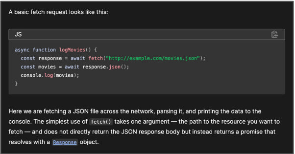

# [Softex (site oficial)](https://softex.br/)

- Curso de Aceleração Front-end da Softex (nesse repositório tem todos os códigos, anotações, atividades e projetos feitos por mim durante o curso)
- [Professor: Augusto Cesar](https://github.com/augustocesarfmo)

## Indíce

- [(Extra) Estudos onlines (joyclass)](/Atividades-Online/README.md)
- [1º Matéria (lógica de programação e JavaScript)](#1º-matéria-lógica-de-programação-e-javascript)
  - [1º Aula (Conceitos básicos - Parte 1)](#1º-aula)
  - [2º Aula (Conceitos básicos - Parte 2)](#2º-aula)
  - [3º Aula (Conceitos básicos - Parte 3)](#3º-aula)
  - [4º Aula (Entrada e manipulação de dados)](#4º-aula)
  - [5º Aula (Condicionais e controle de fluxo)](#5º-aula)
  - [6º Aula (Estruturas de repetição - Parte 1)](#6º-aula)
  - [7º Aula (Estruturas de repetição - Parte 2)](#7º-aula)
  - [8º Aula (Funções)](#8º-aula)
- [2º Matéria (HTML/CSS) ](#2º-matéria-htmlcss)
  - [9º Aula (HTML - Parte 1)](#9º-aula)
  - [10º Aula (HTML - Parte 2)](#10º-aula)
  - [11º Aula (CSS - Parte 1)](#11º-aula)
  - [12º Aula (CSS - Parte 2)](#12º-aula)
  - [13º Aula (CSS - revisão)](#13º-aula)
  - [14º Aula (Extra: Git e Github)](#14º-aula)
  - [15º Aula (Extra: SASS)](#15º-aula)
  - [16º Aula (HTML DOM e Frameworks CSS)](#16º-aula)
- [3º Matéria (TypeScript e React)](#3º-matéria-typescript-e-react)
  - [17º Aula (TypeScript - Parte 1)](#17º-aula)
  - [18º Aula (TypeScript - Parte 2)](#18º-aula)
  - [19º Aula (React - Introdução)](#19º-aula)
  - [20º Aula (React - Componentes)](#20º-aula)
  - [21º Aula (React - Propriedades)](#21º-aula)
  - [22º Aula (React - Renderização Condicional)](#22º-aula)
  - [23º Aula (React - Renderização de Listas)](#23º-aula)
  - [24º Aula (Extra: Apresentação de projeto React)](#24º-aula)
  - [25º Aula (Extra: GitFlow)](#25º-aula)
  - [26º Aula (React - Adicionando Interatividade)](#26º-aula)
  - [27º Aula (React - Atualizações de estado, parte 1)](#27º-aula)
  - [28º Aula (React - Atualizações de estado, parte 2)](#28º-aula)
- [4º Matéria (Web services - Client)](#4º-matéria-web-services---client)
  - [29º Aula (Web services - Introdução)](#29º-aula)

## 1º Matéria (lógica de programação e JavaScript)

### 1º Aula

#### Algoritmos, lógica de programação

- Fases e descrições de algoritmos:

  > Entrada -> Processamento -> Saida  
  > Entrada: valores recebidos pelo sistema  
  > Processamento: aplicação do algoritmo utilizando os valores recebidos  
  > Saida: resultado do algoritmo esperado

- Formas de representar o algoritmos:

  > Narrativa: descrição literal do algoritmo (sequencias de passos)  
  > Fluxograma: descrição através de um gráfico mostrando o fluxo do algoritmo (Inicio -> Fim)  
  > Pséudocódigo: Criar a ideia de um código (usa somente a lógica para demonstrar o código)

- Pensamento sub-algoritmo (principil de facilitar o entendimento do código ao dividir o algoritmo total em sub-partes)

#### JavaScript

- Linguagem de programação voltada para aplicações **web** e **mobile**
- **Fácil execução** e pode ser executada no navegador da internet
- Uma das **mais populares** no mundo. **Fundamental** para os **programadores**
- Executando JavaScript (locais onde pode ser executado)

  > 1. Pelo navegador
  > 2. Pela plataforma [CodePen](https://codepen.io/)
  > 3. Pelo Visual Studio Code (VS Code)

##### **Tipos de dados e variáveis**

- Criando Arquivos base

  > 1. ctrl + N (atalho para criar um arquivo novo)
  > 2. (nome do arquivo).(tipo de arquivo [html, js, py, css etc])

- Tipos de dados básicos:

  > 1. String (valores com texto)
  > 2. Integer (números sem vírgula)
  > 3. Float (números com vírgula)
  > 4. Boolean (valores binários [1,0 / sim ou não])
  > 5. Objeto (conjunto de valores)

- Tipos de dados avançados:

  > 1. Infinity (um numero extremamente pequeno)
  > 2. NaN (um valor não possível [exemplo: ])
  > 3. Null (diferente de zero, não é valor vazio [ocupa espaço na memoria]) - lógica: pense em um voto nulo nas eleições
  > 4. Undefined (espaço de memória ainda não preenchido, não está definido)

- Tipos de variáveis:

  > const - variáveis de valores constantes, não podem ter seus valores alterados (devem ser inicializados no começo)  
  > let - são variáveis que podem ter seus valores alterados **quantas vezes quiser**. Só pode ser vista dentro de um escopo (se estiver no escopo global, pode ser vista globalmente. Se estiver em um local, só sera vista no local)  
  > var - são variáveis que podem ter seus valores alterados **quantas vezes quiser**. Podem ser vista em qualquer escopo(não recomendado o uso pois pode causar confusão no sistema).  
  
  - Ex: let (nome da variável) = [...] - serve para manter vários valores em uma mesma variável.

- typeof("tipo de", serve para apresentar o tipo de uma variável)(Exemplo: console.log(typeof nome))

##### **Operadores Lógicos**

- Operadores matemáticos básicos (+, -, \*, /, %, ==, !=, >, <)

### 2º Aula

- Prática de algoritmo - utilizando os tipos de descrição (narrativa, fluxograma, pseudocódigo)

### 3º Aula

- Prática com Javascript
- Site que ensina Back-end ([Boot.dev](https://boot.dev/)), Python e Go (encontrei durante os estudos, o site está em inglês).

### 4º Aula

#### Entrada e Manipulação de dados

##### 1. Entrada de Dados

- O objetivo do JavaScript é deixar o site dinâmico (uso do comando prompt, para mandar uma mensagem para o console)

##### 2. Conversão de Dados (Cast)

- Formas de altetar:

  > Number("variável") - converte a variável para o tipo Number (número)
  > String("variável") - converte a variável para o tipo String (caractere)

##### 3. Manipulação de Dados

- Concatenação de Dados [Ex: (variável1 + variável2)] {é possivel fazer com diferentes tipos de dados}
- para poder usar printf em JavaScript se deve usar duas crases (`) ao inves de aspas (""). 

  > Ex:  
  > let macaco = "coisa de macaco";  
  > console.log(`${macaco} usar crase ao inves de aspas duplas``);

- Math.random() - retorna um valor entre 0 e 1 (use multiplos para aumentar a variação)
- Math.round() - retorna o valor inteiro arredondado de um valor decimal

### 5º Aula

#### Condicionais e controle de fluxo

##### 1. Condicionais simples

- Condicional unica (if e else): define o fluxo de dados atraves de uma condicional booleana. Tem um caminho caso a posibilidade seja verdadeira e outro se for falsa.
- Condicional encadeada (if, else if e else): define o fluxo de dados através de uma ou mais condições booleanas. Tem diversos caminhos, dependendo do proposito específico.

  > Obs. Combinação de condicionais (&& e ||): permite juntar condições diferentes em um mesmo condicional.
  > && (E): representa que ambas as condições devem ser verdadeiras para a condicional ser true.
  > || (OU): representa que pelo menos uma das condições é verdadeira, a condicional será verddadeira.

##### 2. Condicionais predefinidas

- Condicional interruptor (switch/case): permite criar condicionais pré-definidas (cases) em um interruptor (switch) conectado a um valor (condicional.)

  > Obs. default: representa um 'case' especial que só vai rodar caso todos os outros cases não forem usados.
  > break: serve para quebrar o fluxo de dados, importante no switch para que as outras condições não ocorram quando se busca uma em específico.

##### 3. Condicionais de erro

- try/catch (tentar/pegar): vai testar parte do código, se funcionar continua rodando, se não funcionar o sistema avisa que deu um erro no sistema.
- Obs. se uma string for altera usando o construtor 'Number' ou 'parseInt' o resultado é NaN (vazio)

### 6º Aula

#### Estruturas de repetição (Parte 1)

- Representa um bloco que deve ser repetido um certo número de vezes até certa condição seja alcançada (serve para evitar reescrita de código).

##### For

- Ex: **for**(let i = 0; i < x; i++){...}

> i - representa uma variável mutável (iterador)
> i<x - representa uma condição que continua a repetição, enquanto verdadeira
> i++ - incremento da variável

- break: interrompe totalmente o processo de repetição.
- continue: pula uma repetição do processo de repetição.
- É possível fazer iterações de listas ([código explicando o conceito](https://github.com/GabPSant/Softex/tree/main/codigos-exemplo/javascript/testeFor.js))

### 7º Aula

#### Estruturas de repetição (Parte 2)

##### While

- Ex: **while**(i<x){... i++}

> i - representa uma variável mutável (iterador)
> i<x - representa uma condição que continua a repetição, enquanto verdadeira
> i++ - atualização da variável iteradora

- Importância:

> Usado quando o número de iterações não é conhecida
> Não precisa definir um contador na estrutura
> Repete infinitamente enquanto a condição não é atendida
> Não itera sobre listas (não é ideal, preferrível usar o _for_)

##### Do... While

- Ex: **do**{...}**while**(i<x)
- É como o while, mas ele primeiro executa o comando (do) e depois avalia a condição (while). Tem início pré-definido.

### 8º Aula

#### Funções

- São usadas para **agrupar blocos de código** e **evitar a repetição deles**.
- Uma função pode **recebe parametros de entrada** e **emite uma saída**

## 2º Matéria (HTML/CSS)

### 9º Aula

- revisão geral e fim do 1º módulo;

#### HTML (HyperText Markup Language) - Parte 1

- Função: são usadas para **envolver elementos** e definir sua função
- html -> tag que contem todo o arquivo/estrutura html
- head -> contem a metadata do seu arquivo

> Obs. (meta charset = "UTF-8) contem o arquivo de dados do HTML

##### 1. Tags de texto

- Títulos e subtítulos (h1 a h6): permite criar títulos (h1) e subtítulos (h2 a h6) na página
- Parágrafo (p): permite criar textos parágrafos padrão (cada um quebra a linha)
- Outros tipos:

> strong -> negrito  
> em -> texto em itálico  
> span -> tag génerica de texto  
> br -> quebra de linha (precisa de uma para quebrar)

##### 2. Tágs de lista

- Listas ordenadas (ol -> ordeneted list): cria listas ordenadas
- Listas aninhadas (ul -> unordeneted list): cria listas não ordenadas

> Obs. li (list item) -> defini o elemento especifico da lista

##### 3. Links e navegação

- links básicos:

  > a (anchor/âncora) -> tag que contem o link
  > href = "link url ou arquivo local" -> defini o destino do link

### 10º aula

#### HTML (HyperText Markup Language) - Parte 2

##### 4. Imagens e mídia

- Imagem (img):

  > src -> para buscar um arquivo de imagem  
  > alt -> descrição alternativa da imagem

- Vídeo (video):

  > src -> para buscar um arquivo de vídeo  
  > controls -> adiciona controles de repetição do vídeo

- Áudio (audio):
  > src -> para buscar um arquivo de áudio  
  > controls -> adiciona controles de reprodução de áudio

##### 5. Tabelas

- table: tag de **contêiner** principal para a tabela
  - tr: define uma **linha** na tabela
  - th: é usado para **cabeçalhos** de coluna
  - td: define as **células** dos dados
  - thead : define o cabeçalho da tabela (isso ajuda a diferenciar visualmente o cabeçalho do restante da tabela)
  - tbody : define o corpo da tabela
  - tfoot : define o rodapé da tabela (é comumente usado para **informações adicionais** sobre a tabela)

##### 6. Formulários

- form: usado para criar formulários em HTML
- Tipos de entrada

  > input:  
  > --> Texto  
  > --> Senha  
  > --> Múltipla escolha  
  > --> Caixa de seleção  
  > select: uso do comando option (serve para definir opções para o usuário)

- button: envio do formulário
- Rótulos (label)

  - label - é usado para **associar** um rótulo a um elemento de formulário.
  - for - é usado em label **para corresponder ao atributo** id **do elemento de formulário**

- Agrupamentos de elementos de formulário
  - fieldset - define o bloco de agrupamento
  - legend - fornece uma legenda descritiva para o grupo

##### 7. Estruturação avançada

- tag div: usada para criar uma divisão lógica ou seção de contéudo (é uma tag genérica que pode seu usada para **agrupar elementos** e **aplicar estilos** ou comportamentos a eles)
- Seções

  - Cabeçalho (header): usada para representar uma **seção de navegação** em um documento. Ela é usada para incluir o **logotipo**, o **título do site**, **menus denavegação** e outros elementos introdutórios.
  - Navegação (nav): usado para representar uma **seção de navegação** em um documento. Ela é usada para **agrupar links que levam a outras páginas do site** ou a diferentes seções da mesma página.
  - Conteúdo principal (main): é usada para **envolver o conteúdo principal** de um documento. Geralmente, **só deve háver um main** por página, e ele deve conter o contéudo central do documento.
  - Seções (section): é usada para **divider o conteúdo de uma página** em seções temáticas distintas. Ela é usada para **agrupar e estruturar semanticamente** o contéudo relacionado.
  - Composição (article): é usada para **representar uma composição autônome** e independendte dentro de uma página. Ela é adequada para contéudo que pode ser distribuído e **reutilizado** de forma independente , como **postagens de blog**, **notícias**, etc.
  - Conteúdo relacionado (aside): é usada para **representar conteúdo relacionado** ou suplementar que está separado do conteúdo principal. Ela pode conter informações adicionais, como **barras laterais**, **anúncios**, **contéudo relacionado**, entre outros.
  - Rodapé (footer): é usada para **representar o rodapé de um documento** ou seção. Geralmente, é usada para incluir **informações de direitos autorais**, **links para páginas relacionais**, **informações de contato**, entre outros.

- Visão geral:
  - Essas tags fornecem **uma melhor semântica e estruturação** do conteúdo.
  - **Não são obrigátorias**, e o seu emprego deve ser feito **de acordo com a finalidade e estrutura do seu site**.

### 11º Aula

#### CSS (Cascading Style Sheets) - Parte 1 [[Explicação]](https://github.com/GabPSant/Softex/tree/main/codigos-exemplo/css/exemplo.css)

- Conceitos básicos
  - É uma **linguagem de estilo** utilizada para definir a **apresentação e o design de páginas web**
  - É a ferramenta essencial para **controlar o layout**, as **cores**, as **fontes** e outros aspectos visuais de um site.
- Por que usar CSS
  - Serve para separar a **estrutura (HTML)** do estilo CSS permite maior **flexibilidade** e **manutenção do código**
- Estilos externos
  - Uso da tag 'link' em arquivos HTML para definir a sua conexão com arquivos CSS separado.
- Seletores de tipo
  - Aplicam estiloas a **elementos** (ex: h1, p, a etc) com base em seu **tipo HTML**
- Seletores de classe (use '.' para identificar)
  - Aplicam estiloas a **elementos** (ex: class = "areas") com base em uma **classe atribuida**
- Seletores de classe (use '#' para identificar)
  - Aplicam estiloas a **elementos** (ex: id = "principal") com base em uma **ID exclusivo**
- Exemplos de propriedades
  - color --> define a cor do texto
  - font-size --> define o tamanho da fonte
  - margin --> define a margem da fonte
- Box Model
  - É um conceito fundamental no CSS que descreve como os elementos HTML são **renderizados** e ocupam espaço na página.
  - O modelo é composto por quatro partes principais: **conteúdo**, **padding**, **border** e **margin**.
- FlexBox
  - É um recurso do CSS que permite **criar layouts flexíveis e responsivos** em páginas web.
  - Propriedades do FlexBox

    > display: flex --> define um conteiner flexivel  
    > flex-direction --> define o eixo principal, definindo a direção dos itens  
    > flex-wrap --> define se os itens ficam na mesma linha ou em várias
    > justify-content --> define o alinhamento dos itens ao longo do eixo principal
    > align-items --> define o alinhamento vertical dos itens dentro do contêiner
    > align-content --> define o alinhamento dos itens quando há espaço extra no eixo cruzado

### 12º Aula

#### CSS (Cascading Style Sheets) - Parte 2 [[Explicação]](https://github.com/GabPSant/Softex/tree/main/codigos-exemplo/css/exemplo.css)

- Tipografia
  - color: define a cor do texto
  - font-family: define a família de fontes a ser usada no texto
  - font-size: define o tamanho do texto
  - font-weight: define a espessura do texto
  - font-style: define o estilo do texto
  - text-decoration: define a decoração do texto
  - text-transform: define a transformação do texto
- Cores e Fundos
  - background-color: é usado para definir cores no background da tela, sendo possível definir a cor por nome (Ex:), hexadecimal (Ex: ) e rgb (Ex: )
  - opacity: define a opacidade de um elemento (varia de 0.0 a 1.0)
- Pseudoclasses - permitem **selecionar elementos** com base em **estados** ou **interações** específicas
  - :hover -> seleciona um elemento quando o cursor está sobre ele
  - :active -> seleciona um elemento quando ele é clicado
  - :visited -> seleciona um link já visitado
  - :focus -> seleciona um elemento quando ele recebe foco
- Responsividade e media queries
  - Responsividade:
    > É a **capacidade de um site se adaptar** a diferentes dispositivos e tamanhos de tela.
  - Media queries
    > São uma técnica do CSS que permite **aplicar diferentes estilos** com base em pontos de interrupções (**breakpoints**) e nas **características do dispositivo**.

#### Páginas de apoio

- [Código Exemplo](https://github.com/GabPSant/Softex/tree/main/codigos-exemplo/css/responsividade.css)
- [Google Fonts](https://fonts.google.com/)
- [Cores para HTML](https://htmlcolorcodes.com/)
- [Unidades de medida CSS](https://desenvolvimentoparaweb.com/css/unidades-css-rem-vh-vw-vmin-vmax-ex-ch/)

### 13º Aula

- Revisão de HTML/CSS e termino da tela de [interface](https://github.com/GabPSant/Softex/blob/main/Atividades-Presencial/HTML/materia2/interface.html)

### 14º Aula

#### Aula sobre usar o Git e versionamento de projetos.

- [Git](https://www.atlassian.com/br/git/tutorials/what-is-git)
- [Github](https://tecnoblog.net/responde/o-que-e-github/)
- [Versionamento](https://www.alura.com.br/artigos/versionamento-semantico-breve-introducao?utm_term=&utm_campaign=%5BSearch%5D+%5BPerformance%5D+-+Dynamic+Search+Ads+-+Artigos+e+Conte%C3%BAdos&utm_source=adwords&utm_medium=ppc&hsa_acc=7964138385&hsa_cam=11384329873&hsa_grp=111087461203&hsa_ad=662261334153&hsa_src=g&hsa_tgt=aud-1295637864136:dsa-843358956400&hsa_kw=&hsa_mt=&hsa_net=adwords&hsa_ver=3&gclid=Cj0KCQjwgNanBhDUARIsAAeIcAssrIEUhNR-OxKh-XTncu3qC6ON_qmk5i4jIMOBkUn2KjjsxuT2xJUaApShEALw_wcB)

### 15º Aula

#### [SASS (Syntactically Awesome Style Sheets)](https://sass-lang.com/)

- O que é Sass?
  - É uma linguagem de folhas de estilo que se **estende ao CSS**, fornecendo **funcionalidades adicionais** e **facilitando a escrita e manutenção de código CSS**.
- [Principais recuros](https://sass-lang.com/guide/)
  1. Variáveis - podem **armazenar informações** que você deseja **reutilizar** em toda a sua folha de estilo!
  2. Aninahmento - permite que você **aninhe** seus **seletores CSS** de uma forma que siga a mesma **hierarquia visual do seu HTML**.
     > Atenção - "As regras **excessivamente aninhadas** podem resultar em CSS muito específico, o que pode ser **difícil de manter** e geralmente é considerado uma **má prática**".
  3. Módulos - você não precisa escrever todo o seu **Sass em um único arquivo**. Você pode **dividir** como quiser com a regra '@use'.
  4. Mixins - '@mixins' são **blocos de estilos reutilizáveis** que podem ser **personalizados** atráves de **parâmetros** (basicamente uma função)
  5. Herança - @extend permite **compartilhar** um conjunto

### 16º Aula

#### HTML DOM

- O HTML DOM é um **modelo de objeto padrão** e **interface de programação** para HTML. Ele define:
  1. Os elementos HTML como **objetos**
  2. As **propriedades** de todos os elementos HTML;
  3. Os **métodos** para acessar todos os elementos HTML;
  4. Os **eventos** para todos os elementos HTML.
- Em outras palavras: O HTML DOM **é um padrão de como obter, alterar, adicionar ou excluir** elementos HTML.
- Arvore de objetos HTML DOM:

  

- HTML e JavaScript:
  1. JavaScript pode alterar todos os **elementos** HTML da página;
  2. JavaScript pode alterar todos os **atributos** HTML da página;
  3. JavaScript pode alterar todos os **estilos** CSS da página;
  4. JavaScript pode **remover elementos e atributos** HTML existentes;
  5. JavaScript pode **adicionar novos elementos** e atributos HTML;
  6. JavaScript pode **reagir a todos os eventos** HTML existentes na página;
  7. JavaScript pode **criar novos eventos HTML** na página.

### [Frameworks CSS](https://www.brasilcode.com.br/frameworks-css/)

- É uma ferramente que facilita a **criação de interfaces do usuários** e funcionais, **fornecendo um conjunto predefinido** de estilos, componentes e funcionalidades.  
  

## 3º Matéria (TypeScript e React)

### 17º Aula

#### [TypeScript - Parte 1](https://www.typescriptlang.org/)

- O que é TypeScript?
  - TypeScript é uma linguagem de programação de código aberto que é uma extensão do
    JavaScript. Ela adiciona recursos de tipagem estática ao JavaScript.
  - Isso que significa que você pode declarar o **tipo de dados** para variáveis, **parâmetros de função** e **valores de retorno** de função.
- Outras características do TypeScript
  - TypeScript ajuda a **detectar erros** e **melhorar a manutenção do código**, tornando-o mais seguro e confiável durante o desenvolvimento de aplicativos.
  - TypeScript é **transpilado para JavaScript** para ser executado nos navegadores ou em qualquer ambiente que suporte JavaScript.
- Forma de compilar com ts-node (**importante!**)
  - Primeiramente, é preciso baixar as extenções com npm (node package manager) para poder compilar arquivos typescript na máquina. As extensões necessárias são 'typescript' e 'ts-node'.
  - Comando de instalação (Esse comando devem ser usados no prompt de comando da máquina): 

    ```bash
    npm i -g typescript ts-node
    ```

  - Qualquer informação extra use este [site (link)](https://www.digitalocean.com/community/tutorials/typescript-running-typescript-ts-node), só avisando que o site está em inglês.
  - Agora com isso feito e as extensões instaladas, você pode compilar os arquivos typescript com o comando:

    ```bash
    npx ts-node nome_do_arquivo.ts
    ```

- Forma de compilar com tsx (**importante!**)
  - Essa é outra forma de compilar arquivos typescript usando somente a extensão 'tsx'.
  - Comando de instalação (Esse comando deve ser usado no prompt de comando da máquina):  

    ```bash
    npm i -g tsx
    ```

  - Agora com isso feito e a extensão instalada, você pode compilar os arquivos typescript com o comando:

    ```bash
    tsx nome_do_arquivo.ts
    ```

- [Codigo exemplo](codigos-exemplo/typescript/index.ts)
  - [Video de apoio para os exemplos](https://www.youtube.com/live/GWwuQl0jXU4?si=4jsiWyjXubkuklLa)

### 18º Aula

#### TypeScript - Parte 2

- Passo a passo para usar TypeScript na programação front-end (web)
  - Primeiro, usar o comando **npm init -y**, para instalar o package.json (Criar um projeto JavaScript)
  - Instalar a dependência do desenvolvedor para TypeScript no package.json, usando o comando:

    ```bash
    npm i typescript --save-dev
    ```

    > o '--save-dev' serve para instalar o typescript no dominio do desenvolvedor

  - E por fim iniciar a compilação de arquivos typescript na versão javascript adequada com o comando:

    ```bash
    npx tsc --init
    ```

  - Agora para compilar um arquivo TypeScript especifico é possivel usar o comando: 

    ```bash
    npx tsc nome_do_arquivo.ts
    ```

    > Será criado um código de mesmo nome em JavaScript.

  - Caso queira que o terminal fique compilando constantemente um arquivo TypeScript, use o comando: 

    ```bash
    npx tsc --watch nome_do_arquivo.ts
    ```

    > Caso queira que pare de compilar, use o comando 'CONTROL + C' no terminal.

- [Link para manipulação do construtor Date()](https://date-fns.org/)

### 19º Aula

#### [React - Parte 1](https://react.dev/) (Introdução)

- React **é uma biblioteca de JavaScript** de código aberto, desenvolvida pelo **Facebook**, que é amplamente usada para **construir interfaces de usuário interativas e reativas** para aplicativos da web.
- Ela foi lançada em 2013 e rapidamente se **tornou uma das principais ferramentas** para o desenvolvimento **front-end** moderno.
- Vantagens do React
  - A principal característica do React é sua abordagem de "componentização". Ele permite que os desenvolvedores **dividam a interface do usuário em pequenos componenetes independentes**, cada um com **seu próprio estado** e **comportamento**.
- Criando um novo projeto com React
  - Instalação do Node.js ([link](https://nodejs.org/pt-br))
  - [Next.js](https://nextjs.org/): é um framework React full-stack. É versátil e permite criar apps React de qualquer tamanho – desde um blog estático a um app dinâmico complexo.
  - Execute o comando em seu terminal (dentro de uma pasta especifica): 
  
    ```bash
    npx create-next-app
    ```

    > Ou o comando: 

      ```bash
      npx create-next-app@latest
      ```

  - Responda a lista de perguntas para a instalação do React:

    
  
  - Para rodar o projeto com o terminal (lembrando, o terminal deve ser o da pasta do projeto):

    ```bash
    npm run dev
    ```

- *Obs:* Quando for necessário pegar um arquivo React do github, lembre de instalar o diretório node-modules com o comando:

  ```bash
  npm install node-modules
  ```

- Extensões recomendadas para o VSCode quando usar React ([link](https://react.dev/learn/editor-setup#recommended-text-editor-features))
- Projetos desenvolvidos com React (feitos em outros repositórios)
  - [primeiro-projeto](https://github.com/GabPSant/React-first-project)
  - [post do instagram](https://github.com/GabPSant/post-instagram)
  - [CineLista](https://github.com/GabPSant/Filmes-web)

##### Componentes em React (terminar de anotar o resto...)

- Contexto:
  - Componentes são um dos **conceitos centrais** do React. Um **componente** consiste na combinação de códigos **HTML**, **CSS** e **JavaScript** para construção de "componentes" (interfaces de usuários) **personalizados e reutilizáveis**.
  - Componentes retornam uma estrutura visual do HTML (são funções especiais do React que permitem criar partes reutilizaveis de uma página).
  - Componentes: blocos de interface de usuário ([link de aprendizado](https://react.dev/learn/your-first-component))

- Definindo um Componente ([link de estudo e exemplo prático](https://react.dev/learn/your-first-component#defining-a-component))
- Importando e exportando componentes
  - À medida que você **aninha mais e mais componentes**, geralmente faz sentido começar a **dividi-los em arquivos diferentes**.
  - **Dividir componentes em arquivos** diferentes permite uma **melhor reutilização** em outros lugares e uma **busca mais facilitada**.
  - [Como importar e exportar componentes (link)](https://react.dev/learn/importing-and-exporting-components#exporting-and-importing-a-component)

- Escrevendo marcações com JSX
  - Por muitos anos, os desenvolvedores da Web mantiveram o **conteúdo HTML, CSS e JavaScript** em **arquivos diferentes**. **JSX** permite escrever **lógica de renderização** e de **marcação juntas** no mesmo lugar.
  - [As Regras do JSX, Documentação React](https://react.dev/learn/writing-markup-with-jsx#1-return-a-single-root-element)

- [JavaScript em JSX, Documentação React](https://react.dev/learn/javascript-in-jsx-with-curly-braces#passing-strings-with-quotes)

### 20º Aula

#### React - Parte 2 (Componentes)

- Componentes
  - O que são componentes?

    > Componentes são um dos **conceitos centrais** do React. Um **componente** consiste na
    combinação de códigos **HTML, CSS e JavaScript** para construção de "componentes"
    (interfaces de usuários) **personalizados** e **reutilizáveis**.

  - Importando e exportando componentes:

    > À medida que você aninha mais e mais componentes, geralmente faz sentido começar a
    dividi-los em arquivos diferentes.

    > Dividir componentes em arquivo diferentes permite uma melhor reutilização em outros
    lugares e uma busca mais facilitada.

  - Escrevendo marcação com JSX:

    > Por muitos anos, os desenvolvedores da Web mantiveram o conteúdo HTML, CSS e
    JavaScript em arquivos diferentes. JSX permite escrever lógica de renderização e de
    marcação juntas no mesmo lugar.

- Documentação (links para exemplos práticos):
  - [Componentes: blocos de interface de usuário](https://react.dev/learn/your-first-component)  
  - [Documentação React](https://react.dev/learn/your-first-component#defining-a-component)  
  - [Como importar e exportar componentes?](https://react.dev/learn/importing-and-exporting-components#exporting-and-importing-a-component)  
  - [As regras do JSX | Documentação React](https://react.dev/learn/writing-markup-with-jsx#1-return-a-single-root-element)  
  - [Passando strings com aspas | Documentação React](https://react.dev/learn/javascript-in-jsx-with-curly-braces#passing-strings-with-quotes)


### 21º Aula

#### React - Parte 3 (Props/Propriedades)

- Props (propriedades)
  - O que são props?

    > **Props são informações** que você passa para uma tag JSX. Por exemplo, className ,
    src, alt width e height são algumas props que você pode passar para uma 'img'.
  
  - Exemplificando

    > Um componente <Avatar> **pode ser renderizado de várias maneiras** através de
    **diferentes propriedades**.
    
    > 

- Documentação (link para exemplo prático)
  - [Passando props para um componente](https://react.dev/learn/passing-props-to-a-component#familiar-props)

### 22º Aula

#### React - Parte 4 (Renderização Condicional)

- Renderização Condicional
  - O que é renderização condicional?

    > Renderização condicional consiste na **exibição de coisas diferentes**, **dependendo de diferentes condições**.

    > No React, podemos renderizar **JSX condicionalmente** utilizando as instruções if, && e os operadores e ? :.

  - Exemplificando:

    > Como eu posso marcar com um ✔ os itens de uma lista a partir de uma condição?  
    > Exemplo:

    > 
  
- Documentação React
  - [Como usar renderização condicional em React](https://react.dev/learn/conditional-rendering#conditionally-returning-jsx)

### 23º Aula

#### React - Parte 5 (Renderização de Listas)

- Contextualizando
  - Frequentemente, você precisará mostra **várias instâncias do mesmo componente**
  utilizando dados diferentes. Nessas situações, **arrays JavaScript** podem ser utilizados na
  **renderização de listas**.
  - Exemplo:

    

- Documentação React
  - [Como usar renderização de lista em React](https://react.dev/learn/rendering-lists#rendering-data-from-arrays)


### 24º Aula

  - Apresentação em sala do projeto React desenvolvido em equipe
    - A ideia do meu grupo foi fazer uma lista de filmes do projeto:
      
      > [Filmes-web (link do repositório)](https://github.com/GabPSant/Filmes-web)  
      > [Filmes-web (deploy)](https://filmes-web-one.vercel.app/)

    - Se quiser pode pegar o repositório com esse comando abaixo (Existe um passo a passo bem detalhado no repositório) 

      ```bash
        git clone https://github.com/GabPSant/Filmes-web.git
      ```

  - Membros do projeto
    - [@GabPSant](https://www.github.com/GabPSant)
    - [@MariCruz31](https://www.github.com/MariCruz31)
    - [@Giselle-Jacinto](https://www.github.com/Giselle-Jacinto)
    - [@sthallysson](https://www.github.com/sthallysson)

### 25º Aula

#### GitFlow

  - O Git Flow é recomendado para projetos que utilizam versionamento semântico (semantic versioning) ou que precisam oferecer suporte a várias versões de seu software.
  - [Explicação detalhada (Alura)](https://www.alura.com.br/artigos/git-flow-o-que-e-como-quando-utilizar)

### 26º Aula

#### Adicionando Interatividade

  - Contextualizando
    - Algumas coisas na tela são atualizadas em **resposta à entrada do usuário**. Por exemplo,
    clicar em uma imagem da galeria alterna a imagem ativa. No React, os **dados que mudam**
    **com o tempo** são chamados de estado.
  - Obs: children são do tipo React.ReactNode;
  - Documentação React
    - [Respondendo a Eventos](https://react.dev/learn/responding-to-events)
    - [Estado: memória de um componente](https://react.dev/learn/state-a-components-memory)

### 27º Aula

#### Atualizações de estado (Parte 1)

  - Documentação React
    - [Enfileirando atualizações de estado](https://react.dev/learn/queueing-a-series-of-state-updates)
    - [Atualizando objetos no estado]()

### 28º Aula

#### Atualizações de estado (Parte 2)

  - Documentação React
    - [Atualizando arrays no estado](https://react.dev/learn/updating-arrays-in-state)

## 4º Matéria (Web services - Client)

### 29º Aula

#### Arquitetura da Web

  - Arquitetura Cliente/Servidor

    
  
  - Comunicação entre os componentes
    - Protocolo HTTP:
      - Define um **conjunto de regras** (métodos, status de resposta, entre outros) que **padroniza a comunicação** entre diferentes componentes.
    - Uniform Resource Identifier (URI):
      - É uma sequência compacta de caracteres para **identificar um recurso** na web.
    - Informações
      - São **mensagens de texto** trocadas entre o cliente e o servidor nas operações de request e response.
  - Web services
    - Web services, ou serviços web, são sistemas de software projetados para permitir a comunicação e interação entre diferentes aplicativos pela internet.
    - As abordagens mais comuns para a implementação de serviços web:
      - SOAP (Simple Object Access Protocol).
      - REST (Representational State Transfer).

        > Ambos são usados para definir a forma como os dados são trocados entre os sistemas.

#### [REST](https://www.alura.com.br/artigos/rest-conceito-e-fundamentos)

  - Estilo arquitetural REST
    - REST (Representational State Transfer) é um **estilo arquitetural** que impõe uma série de restrições quanto à forma como os componentes da arquitetura web se relacionam (FIELDING, 2000).
    - Os sistemas em conformidade com REST, muitas vezes conhecidos como aplicações **RESTful**, têm como principal característica a forma como separam as responsabilidades entre o cliente e o servidor.
  - Restrições REST:

    1. **Cliente-servidor**;
    2. Sem estado;
    3. Cache;
    4. Sistemas em camadas;
    5. Código sob demanda;
    6. **Interface uniforme**

  - API REST
    - Uma API REST é um tipo específico de **web service** que segue os princípios RESTful.

      [](https://www.linkedin.com/feed/update/urn:li:activity:7127648415538122753/)

  - Identificação de recursos
    - Todo recurso deve ser identificado utilizando o conceito de URI (Uniform Resource Identifier), ou identificador uniforme de recurso.
    - Sintaxe:
      - protocolo://hostname:porta/endpoint
    - Por exemplo:
      - http://servicorest.com/produtos
      - http://servicorest.com/clientes
      - http://servicorest.com/vendas

  - Métodos HTTP
    - A Tabela sintetiza e exemplifica a utilização dos principais métodos HTTP através de uma aplicação de gerenciamento de usuários.

      | Endpoint | Método | Ação |
      | -------- | ------ | ---- |
      | /users | GET | Retorna a lista de usuários |
      | /users | POST | Insere um novo usuário |
      | /users/{id} | GET | Retorna o usuário com id = {id} |
      | /users/{id} | PUT | Substitui os dados do usuário com id = {id} |
      | /users/{id} | DELETE | Remove o usuário com id = {id} |

#### JSON Server

  - [API REST fake (GitHub)](https://github.com/typicode/json-server)

    

  - [Fetch API (Mozilla)](https://developer.mozilla.org/en-US/docs/Web/API/Fetch_API/Using_Fetch)

    